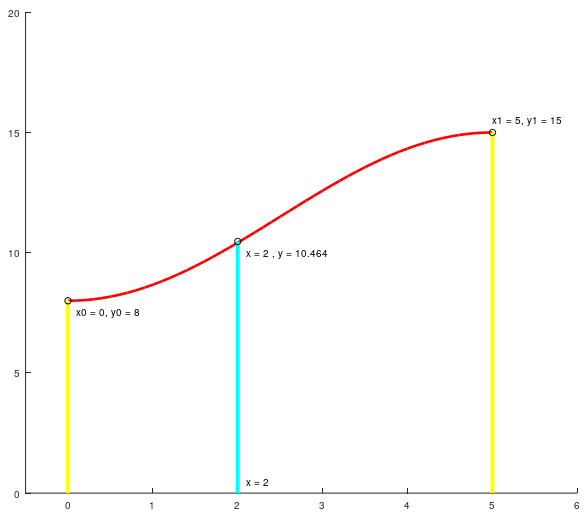

# Interpolation and Fade functions

***
## Table of contents
- [Intro](#intro)
- [Linear interpolation](#linear-interpolation)
- [Cosine interpolation](#cosine-interpolation)
- [Original Perlin Fade Function](#original-perlin-fade-function)
- [Improved Perlin Fade Function](#improved-perlin-fade-function)
- [Properties](#properties)
    - [Number of necessary known values](#number-of-necessary-known-values)
    - [Scope, Range and an example](#scope-range-and-an-example)
    - [First order derivative](#first-order-derivative)
    - [Second order derivative](#second-order-derivative)
- [Comparison of interpolators](#comparison-of-interpolators)
- [2D Interpolation (bilinear)](#2d-interpolation-bilinear)

***
# Intro
When reviewing Value noise and Perlin noise, the use of interpolation methods  (or fade functions) is very important. They play a key role in one of the properties we are looking for in a noise function: **smoothness**.  

I think it is good to revisit these functions and understand them, where do they come from and why and how are they useful, as it is very likely that we use them in other scenarios that are not limited to the noise generation. 

An interpolation function can be defined as **a mathematical method to estimate or infer the value of a function at a given point `x_p` using other available values of this function at different points**. 

When generating noise, we use the interpolation method to find the values of all the positions inside a lattice (collection of `x_p`) using our available values of the function (the values of the noise at the lattice point).

To explore what the interpolation methods are about, we will assume a 1D signal interpolation with the following notation:
```math
\begin{aligned}
(x_0, y_0) &\qquad \text{The first interpolation point - lattice point}
\\[2ex]
(x_1, y_1) &\qquad \text{The second interpolation point - 2nd lattice point}
\\[2ex]
(x_p, y_p) &\qquad \text{The point to be interpolated}
\end{aligned}
```

Let's review 4 interpolation methods, the *linear interpolation* which is most basic one, and the *cosine interpolator* and Perlin's fade functions, that are the ones that are used to generate Value noise and Perlin noise. 

# Linear interpolation

Linear interpolation is the most basic interpolation method that provides continuous functions (the *nearest neighbor interpolator* is more basic but it yields non continuous signals). The basic assumption of this interpolator is that **the function we are trying to estimate is a line between two points**, so every estimated value will be in the line that goes between the first lattice value and the second:

```math
y_p = y_0 + (y_1 - y_0) \frac{x_p - x_0}{x_1 - x_0}
```

The linear interpolation function in the interval `(0,1)` looks like this:
<div style="width:50%; margin: auto;">
<p align="center" width='50%'>

</p>
</div>

This interpolator provides **bad results** in terms of smoothness. Its use is not recommended, but it serves as a starting point to review the methods we will consider.

# Cosine interpolation
To render value noise, I take advantage of the **cosine interpolation** method to interpolate a function between two points. I opt for that method because consine interpolators only need 2 data points to interpolate the ones in the middle, it is fast and simple and it provides a much more smoother transition than the basic linear interpolator. 

I have already discussed the implementation details of the cosine interpolator in the [value noise aricle](./valuenoise.md#how-is-it-generated), but just for quick comparison, the interpolation formula is the following:

```math
\begin{aligned}
angle &= x_p * \Pi  \qquad \qquad ;x_p \in (0,1)
\\[2ex]
w &= \frac{1 - \cos{(angle)}}{2}
\\[2ex]
y_p &= y_0*(1-w) + y_1 * w
\end{aligned}
```
The cosine interpolation function in the interval `(0,1)` looks like this:
<div style="width:50%; margin: auto;">
<p align="center" width='50%'>

</p>
</div>

Notice how the function is not a straight line from 0 to 1, but is has some degree of curve provided by the trigonometric function. That curve is the smooth factor that we can see in transition between lattices in our noise. 

# Original Perlin Fade Function
In his original article, Ken Perlin **proposed the following fade function to be used along a linear interpolation**. The function was really simple and looks like this:

```math
\begin{aligned}
w &= 3x_p^2 - 2x_p^3 \qquad \qquad ;x_p \in (0,1)
\\[2ex]
y_p &= y_0*(1-w) + y_1 * w
\end{aligned}
```
The function looks very similar to the cosine interpolation function:
<div style="width:50%; margin: auto;">
<p align="center" width='50%'>

</p>
</div>

The motivation of such a proposal was to find resulting signals that were smooth when transitioning from one point to another in contrast to the results provided by the linear interpolator. The fade function can be seen as a correcting factor of the linear value that ensures such smoothness.

Why did Ken Perlin come up with something so similar to existing interpolators?

Aside from the properties of the function itself that will be reviewed lated, I guess the answer has to be computational efficiency. The original article is from the 80s and back then we were used to count processor cycles to speed up things ;). 

Perlin original fade function can be computed like this:

```csharp
// 3x^2 - 2x^3
fade = x*x * (3 - 2*x);
```
Coding the fade function like this is efficient and does not use of any `cos` or other trigonometric programming instruction, wich were introduced in the 386 intel processor (after Perlin's article) and had to be solved using LUTs (indirecting memory was way slower than multiplying.)

The fade function though, does the trick, it provides results that depend only on two interpolation points and it also yields smooth transitions between lattices, and as you can observe the function output is almost identical to the cosine interpolator, yet much more efficient from a computation standpoint (especially in the 80s). 

# Improved Perlin Fade Function

In his second article, _Improving Noise_, 2002, Perlin revisits his original algorithms and makes 2 substantial changes. The first one has to do with the gradients and noise generation and has been reviewed in th [Perlin noise entry](./perlinnoise.md), but the second is a replacement of his original fade function. 

Perlin proposes:

```math
w = 6x_p^5 - 15x_p^4 + 10x_p^3 \qquad \qquad ;x_p \in (0,1)
```
instead of his original

```math
w = 3x_p^2 - 2x_p^3 \qquad \qquad \qquad ;x_p \in (0,1)
```
<br/>

The motivation of this change is that Perlin observed that his original fade functions produced noise artifacts due to the properties of the second derivative of the original fade function, this will be detailed in the [properties subsection](#properties-of-the-fade-functions).

The application of the fade function is exactly the same:

```math
y_p = y_0*(1-w) + y_1 * w
```

The improved fade function looks very similar to the cosine and original interpolators, but it is a little bit more smoother on the values around 0 and 1.
<div style="width:50%; margin: auto;">
<p align="center" width='50%'>

</p>
</div>


From a computation standpoint, this polynomic interpolator can also be optimized to compute fastly - but in 2002 (article date), the processor speeds were way faster than in the 80s, so there was no risk of performance hiccups. 

Most of the implementations follow the same idea of the original fade function

```csharp
// 6x^5 - 15x^4 + 10x^3
fade_improved = x*x*x * (10 + x*(-15 + 6*x));
```

Nowadays, it makes little sense to use the original fade function since the improved version has better properties and does not pose a problem from the performance point of view. 

# Properties

## Number of necessary known values
In order to be able to produce noise signals as we do in the value noise and Perlin noise case, **we need interpolation methods that allow us to yeld value from only a pair of lattice values** - basically the initial and final value. 

There are higher order interpolators (such as splines, cubic, hermite, etc..) that provide smoother results taking into account more context, but they need more lattic points and involve more computation. 

## Scope, Range and an example
Notice as well that the inteporlators are defined in a scope between **0 and 1**. The **range** of the interpolation function is $w \isin [0,1]$, strictly increasing. 

When we want to find a value $x_p$ that is contained between the first lattice point and the second, *we use the fade function to know how much does each lattice point influence the value we are trying to find*.

Inspecting the intepolation function it is easy to see what are we doing here:

```math
y_p = y_0*(1-w) + y_1 * w
```

What we are saying here is that a value $y_p$ is a linear combination of the lattice value $y_1$ influenced by $w$ and the lattice value $y_0$ influenced by the complementary of $w$, that is $(1-w)$.

$w$ and $(1-w)$ are weight factors that add up to 1, obvioulsy, and that can be seen a the _percentage_ that each lattice point influences on the final value $y_p$. That influence is dictated by $x_p$, that is to say, from the distance of the point to be estimated to each of the lattice values. 

Take this example where I will be interpolating a value using the Perlin original fade function, step by step:

<div style="width:50%; margin: auto;">
<p align="center" width='50%'>

</p>
</div>

```
The steps of this example can be found at: 
matlab_related_topics folder/sampleInterpScopeRange.m 
```

We have two lattice points:

```math
\begin{aligned}
(x_0, y_0) &= (0,8)
\\[2ex]
(x_1, y_1) &= (5,15)
\end{aligned}
```
And we want to interpolate the value at $x = 2$ using the Perlin original fade function. 

This interpolation is a value $y$ that results from the influence of $y_0$ and $y_1$. The amount of influence each value has depends on the x-position of $x$, the closer the x-position is to a lattice point, the more influence it will have on the interpolated value. 

In this case we have $x=2$. The lattice segment is defined between 0 and 5, so 2 is closer to 0 than it is to 5, therefore the first lattice point $(0,8)$ should have more influence to the result than the second, $(5,15)$.

Let's see. The first step is to normalize $x$ in order to find $x_p$. 

```math
\begin{aligned}
x_p &= x / (x_1-x_0)
\\[2ex]
x_p &= 2 / (5-0)
\\[2ex]
x_p &= 0,4
\end{aligned}
```
With $x_p$ we can now find $w$ with Perlin Fade function:
```math
\begin{aligned}
w &= 3 * x_p^2 - 2* x_p^3
\\[2ex]
w &= 3 * (0,4)^2 - 2* (0,4)^3
\\[2ex]
w &= 0,352
\end{aligned}
```

We only have to interpolate the value taking into account the weight we just found. Notice that in the formula we have:

```math
y_p = y_0*(1-w) + y_1 * w
```

We could state this:
```math
y_p = y_0*\text{ (influence of first lattice)} + y_1 * \text{ (influence of second lattice)}
```

So you can see how $w$ tunes the influence of each value of the lattice points in the final result. Since we know that $x = 2$ is closer to $x_0$ than it is to $x_1$, the influence of the first lattice should be greater. Let's check it out.
```math
\begin{aligned}
\text{ (influence of first lattice)} &= (1-w) = 1-0,352 = 0,648
\\[2ex]
\text{ (influence of second lattice)} &= w = 0,352
\end{aligned}
```
Finally, the $y$ value for $x=2$ is yielded. 
```math
\begin{aligned}
y_p &= y_0*(1-w) + y_1 * w
\\[2ex]
y_p &= 8*0,648 + 15 * 0,352
\\[2ex]
y_p &= 10,464
\end{aligned}
```
You can easily see how an interpolated value is nothing more than a weighted computation of a value from the influence of its lattice points (hence the letter $w$ for $weight$ in the fade functions).


## First order derivative
The first order derivative of a function tells us if a function increases, decreases or has a local maxima/minima (doesn't increase or decrease) at a given point. This is very important for the **smoothness** property of our interpolation, because in order to yield continuous and smooth results when interpolating values and **especially when transitioning from a lattice to the next** we want the interpolation function to have a **0 valued first order derivative** at the transition points. 

Let's study which are the derivatives of our functions:

### Cosine interpolator

- Function: $w = \frac{1 - \cos{(x_p * \pi)}}{2}$
<br/>
- **First order derivative:** $w' = \frac{\pi\sin{(x_p * \pi)}}{2}$

Evaluation of $w'$ at 0 and 1 (remember that our fade functions are defined for the normalized range $x \isin [0,1]$):
```math
\begin{aligned}
w' &= \frac{\pi\sin{(x_p * \pi)}}{2}
\\[2ex]
&\text{Evaluate at values x=0 and x=1}
\\[2ex]
w'(0) &= \frac{\pi\sin{(0)}}{2} = 0
\\[2ex]
w'(1) &= \frac{\pi\sin{(\pi)}}{2} = 0
\end{aligned}
```
We can see that the interpolation function first order derivative is 0 in the edges where the function is defined. That ensures that lattices connect in conditions where the fade function does not increase nor decrease, ensuring that there is smoothness and continuity, without bad looking results where we get chunks that are increasing connected to chunks that are decreasing (something we see in the linear interpolator).

### Perlin Original Fade Function

- Function: $w = 3  x_p^2 - 2 x_p^3$
<br/>
- **First order derivative:** $w' = 6x_p - 6x_p^2$

Evaluation of $w'$ at 0 and 1 (remember that our fade functions are defined for the normalized range $x \isin [0,1]$):
```math
\begin{aligned}
w' &= 6x_p - 6x_p^2
\\[2ex]
&\text{Evaluate at values x=0 and x=1}
\\[2ex]
w'(0) &= 6*0 - 6*0 = 0
\\[2ex]
w'(1) &= 6*1 - 6*1 = 0
\end{aligned}
```
We can see the same case with the Perlin original fade function.

### Perlin Improved Fade Function

- Function: $w = 6x_p^5 - 15x_p^4 + 10x_p^3$
<br/>
- **First order derivative:** $w' = 30x_p^4 - 60x_p^3 + 30x_p^2$

Evaluation of $w'$ at 0 and 1 (remember that our fade functions are defined for the normalized range $x \isin [0,1]$):
```math
\begin{aligned}
w' &= 30x_p^4 - 60x_p^3 + 30x_p^2
\\[2ex]
&\text{Evaluate at values x=0 and x=1}
\\[2ex]
w'(0) &= 30*0 - 60*0 + 30*0= 0
\\[2ex]
w'(1) &= 30*1 - 60*1 + 30*1= 0
\end{aligned}
```
Finally, we also see that the Perlin improved function also has a 0-valued first order derivative for $x_p = 0$ and $x_p = 1$.

## Second order derivative

The second order derivative tells us which is the rate change of the first order derivative of a function. The best way to understand it is to think about kinematics in physics: the original function would tell us the position in time (space), the first order derivative yields the _velocity_ formula, and the second order derivative yields the _acceleration_, that is the change rate of the velocity. 

When we use a fade function that has a second order derivative that equals 0 for the $x$ values 0 and 1, we have a function that not only yields smooth results, but produces less artifacts, as it was demonstrated by Perlin in his second paper, and this was the main motivation to introduce his new fade function when revisiting his algorithm. 

We will see that not all the interpolators we have reviewed have a good second order derivative. 

```
The calculation of the functions below and graphs can be seen at
matlab_interpolation/fadeDerivatives.m 
```

### Cosine interpolator

- Function: $w = \frac{1 - \cos{(x_p * \pi)}}{2}$
- First order derivative: $w' = \frac{\pi\sin{(x_p * \pi)}}{2}$
<br/>
- **Second order derivative:** $w'' = \frac{\pi^{2} \cos{(\pi x_{p})}}{2}$


Evaluation of $w''$ at 0 and 1 (remember that our fade functions are defined for the normalized range $x \isin [0,1]$):
```math
\begin{aligned}
w' &= \frac{\pi^{2} \cos{(\pi x_{p})}}{2}
\\[2ex]
&\text{Evaluate at values x=0 and x=1}
\\[2ex]
w'(0) &= \frac{\pi^{2} \cos{(0)}}{2} = \frac{1}{2}
\\[2ex]
w'(1) &= \frac{\pi^2\cos{(\pi)}}{2} = -\frac{1}{2}
\end{aligned}
```

<div style="width:50%; margin: auto;">
<p align="center" width='50%'>

</p>
</div>

The cosine interpolator has a second order derivative that is not 0 for the values $x=0$ and $x=1$, so it is likely to produce artifacts. 

### Perlin Original Fade Function

- Function: $w = 3  x_p^2 - 2 x_p^3$
- First order derivative: $w' = 6x_p - 6x_p^2$
<br/>
- **Second order derivative:** $w'' = 6 - 12x_p$

Evaluation of $w'$ at 0 and 1 (remember that our fade functions are defined for the normalized range $x \isin [0,1]$):
```math
\begin{aligned}
w' &= 6x_p - 6x_p^2
\\[2ex]
&\text{Evaluate at values x=0 and x=1}
\\[2ex]
w'(0) &= 6*0 - 6*0 = 0
\\[2ex]
w'(1) &= 6*1 - 6*1 = 0
\end{aligned}
```
<div style="width:50%; margin: auto;">
<p align="center" width='50%'>

</p>
</div>

With the original Perlin fade function, we see similar results and features we have with the cosine interpolator. Although faster, the results we get with the original Perlin fade function will be somewhat similar to the ones yielded by the cosine interpolator. 

### Perlin Improved Fade Function

- Function: $w = 6x_p^5 - 15x_p^4 + 10x_p^3$
- First order derivative: $w' = 30x_p^4 - 60x_p^3 + 30x_p^2$
<br/>
- **Second order derivative**: $w'' = 120x_p^3 - 180x_p^2 + 60x_p$

Evaluation of $w'$ at 0 and 1 (remember that our fade functions are defined for the normalized range $x \isin [0,1]$):
```math
\begin{aligned}
w' &= 30x_p^4 - 60x_p^3 + 30x_p^2
\\[2ex]
&\text{Evaluate at values x=0 and x=1}
\\[2ex]
w'(0) &= 30*0 - 60*0 + 30*0= 0
\\[2ex]
w'(1) &= 30*1 - 60*1 + 30*1= 0
\end{aligned}
```
<div style="width:50%; margin: auto;">
<p align="center" width='50%'>

</p>
</div>

With the improved Perlin fade function, however, the second order derivative evaluates to 0 for both $x=0$ and $x=1$. We will see in the next section how the use of this interpolator can produce better results than the previous ones, as claimed by the author himself.

# Comparison of interpolators
```
The comparison next and graphs can be found at the matlab script
matlab_interpolation/fadeFunctions.m and matlab_interpolation/interpComparison.m 
```

Let's first show the interpolators jointly in the same image:

<div style="width:50%; margin: auto;">
<p align="center" width='50%'>

</p>
</div>

<div style="margin: auto;">
<p align="center">

</p>
</div>

<div style="margin: auto;">
<p align="center">

</p>
</div>

<div style="margin: auto;">
<p align="center">

</p>
</div>

<div style="width:50%; margin: auto;">
<p align="center" width='50%'>

</p>
</div>

<div style="margin: auto;">
<p align="center">

</p>
</div>

<div style="margin: auto;">
<p align="center">

</p>
</div>


To check how the interpolators behave and perform, one visual way is to display them doing the same task: Let's dispose a set of points to interpolate and visualize the results.


# 2D Interpolation (bilinear)

I reviewed 2D interpolation with the value noise article as it is critical to be able to produce 2D noise (and extend the approach to _n dimensions_). However, in the value noise case, only the cosine interpolator was considered, as I wanted to introduce the diffrent fade functions with the Perlin noise, where they were effectively presented. 

Let's recap 2D interpolation now, starting from the 1D case, where we have 2 lattice points $(x0, y0)$ and $(x1,y1)$. 

When we want to interpolate the value $y_p$ of a point $x_p$ that complies with $x0 < x_p < x1$ we interpolate its value using one of the 3 interpolators or fade functions reviewed. 

<div style="width:75%; margin: auto;">
<p align="center">

</p>
</div>

<br/>

In 2D, we can use the same method but we have to take into account that we have to consider 4 lattice points instead of two, so the problem becomes:
```math
\text{Given four lattice points:}
```
```math
\begin{aligned}
L_{00} &= (x0, y0, z00)
\\[2ex]
L_{01} &= (x0, y1, z01)
\\[2ex]
L_{10} &= (x1, y0, z10)
\\[2ex]
L_{11} &= (x1, y1, z11)
\end{aligned}
```
```math
\text{We want to find the value z of a known position (x, y), given that:}
```
```math
\begin{aligned}
x0 < &x < x1
\\[2ex]
y0 < &y < y1
\end{aligned}
```

In order to retrieve $z$ at $(x,y)$ , we:

- **Step 1**: Consider 2 opposite lattice sides:
`Side 0 => From (x0,y0) to (x0, y1)`
`Side 1 => From (x1,y0) to (x1, y1)`
And find the values `nx0` and `nx1`, resuting from:
`nx0 = Interpolate(Side0 at Y)`
`nx1 = Interpolate(Side1 at Y)`
<br/>

- **Step 2**: With values `nx0` and `nx1`, find `z`:
`Z = Interpolate(nx0 to nx1 at X)`

<br/>

I guess we could call this a "bicosine" interpolation :) . The bilinear intepolation can be easily understood with some visual support:

<table style="width:100%">
    <tr>
        <th style="width:33%">Initial setup</th>
        <th style="width:33%">Step 2</th>
        <th style="width:33%">Step 3</th>
    </tr>
    <tr>
        <td></td>
        <td></td>
        <td></td>
    </tr>
    <tr>
        <td>Our lattice, showing the values of the 4 lattice points (corners) - in orange</td>
        <td>Full interpolation of Side 0 and Side 1 through axis Y, to find nx0 and nx1 - in blue</td>
        <td>Interpolation nx0 and nx1 through axis X (in red). Found the desired value Z at (X,Y) - dark gray line </td>
    </tr>
</table>

```
Detailed code of the 2D interpolation can be found in valueNoise2DInterpolationDemo.m
```
<br/>

***
[Back to top](#table-of-contents)
[Back to noise index](readme.md)