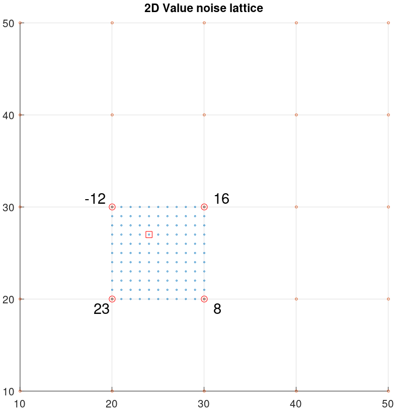
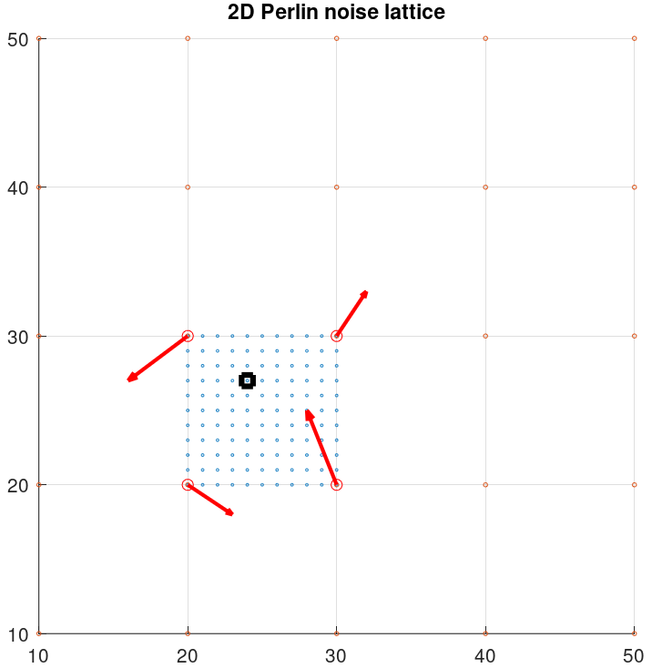
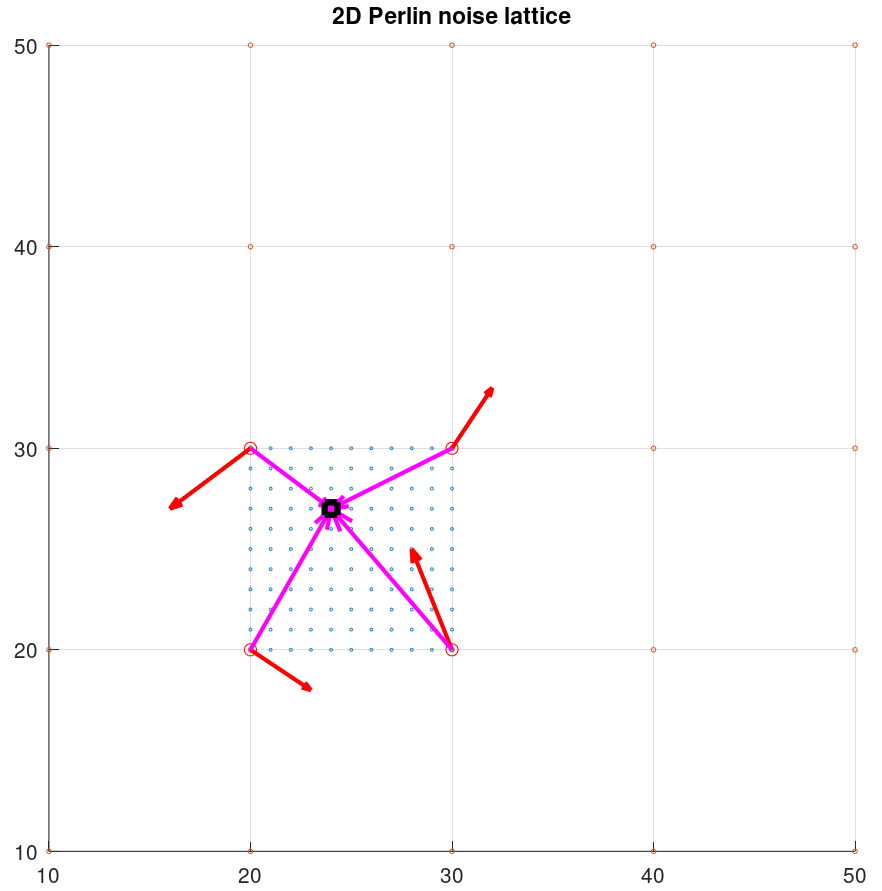
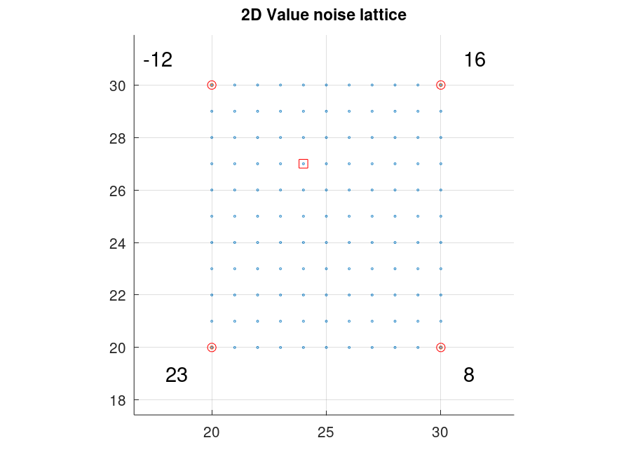
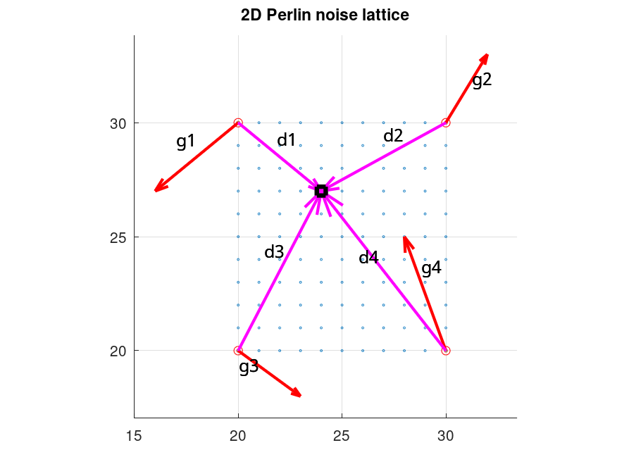

<script type="text/javascript"
  src="http://cdn.mathjax.org/mathjax/latest/MathJax.js?config=TeX-AMS-MML_HTMLorMML">
</script>
# Perlin Noise Basics (Very WIP)

## Table of Contents

- [Perlin Noise](#perlin-noise)
    - [From wavelength to frequency](#from-wavelength-to-frequency)
    - [From cosine interpolation to fade functions](#from-cosine-interpolation-to-fade-functions)
        - [Cosine interpolation](#cosine-interpolation)
        - [Original Perlin Fade Function](#original-perlin-fade-function)
        - [Improved Perlin Fade Function](#original-perlin-fade-function)
    - [2D Perlin Noise](#2d-perlin-noise)
    - [1D Perlin Noise](#1d-perlin-noise)
    - [Recap: Value Noise vs Perlin Noise](#recap-value-noise-vs-perlin-noise)

- [Improved Perlin Noise](#improved-perlin-noise)
    - [From random gradients to a randomized set](#from-random-gradients-to-a-randomized-set)
    - [Fade function improvements](#fade-function-improvements)
    - [Reference implementation](#reference-implementation)
- [Composition and textures](#composition-and-textures)
    - [Octaves](#octaves)
    - [Fractality](#fractality)
    - [Textures from noise](#textures-from-noise)
        - [Turbulence](#turbulence)
        - [Marble](#marble)
        - [Wood](#wood)
        - [Water](#water)
        - [Fire](#fire)
        - [Clouds](#clouds)


# Original Perlin Noise

Perlin noise was first introduced by Ken Perlin 1985 paper _[An Image Synthesizer](https://dl.acm.org/doi/10.1145/325165.325247)_. The paper is a cornerstone in the research and evolution of CGI, since it presented a novel way to implement solid textures that were generated computationally. The key method to attain such textures (the original paper showed examples of water, crystal, fire, clouds and marble texture) is the **Perlin noise algorithm**.

When explaining value noise, we started with 1D noise to jump later into the 2 dimensions, to generate noise impages and heightmaps. We will not follow the same road this time - as I think Perlin noise is much easier to understand if we jump straight to the 2D case. 


## From wavelength to frequency
Before we get into the Perlin Noise algorithm, there's some foreword to be explained. In the value noise case, I have used the **wavelength** concept to refer to the separation between two consecutive lattice points. 

This terminology is borrowed (and misused) from the signal processing theory, that defines the wavelength as the **distance that a signal takes to repeat its pattern**. We have defined the wavelength before as the distance between lattice points, which although not technically matching the signal theory definition, it does provide a conceptual framework to work with. 

Now, for the perlin noise case, we will **use the frquency instead.** 

The definition of the wavelength is as follows:

```
frequency = 1 / wavelength
```
Ok, so frequecy is the inverse of wavelength - same as signal processing. What does it mean? 

Frequency tells us **how often we encounter a lattice point**, or **how much space do we have between lattice points**.

A frequency of 1 would tell us that _every point is a lattice point_, while a frequency of `1/500 = 0.002` would tell us that we have a lattice point every 500 points (wavelength = 500).

The reasons to use the frequency instead are manifold:

- It offers some computational advantages when coding the algorithm
- Most of the literature is using frequency and not distance or wavelength
- Most of the frameworks and libraries use frequency, including *Processing*

I used the wavelenght concept when detailing the value noise because I found that it would be easier to relate to this kind of distance concept when talking about what was happening within the grid - but now that it is clear, it makes sense to switch to the nomenclature that is mostly used in almost every book and internet site. 

## From cosine interpolation to fade functions
Another change that I am introducing in the Perlin noise with respect to the Value noise is the fade functions to interpolate values. When rendering Value noise, we do not have any interpolation alogrithm or fade function that is standard, we can choose any that fits our need, from the most basic linear interpolation to more advanced ones (see [interpolation](https://en.wikipedia.org/wiki/Interpolation) or [Paul bourke quick review](https://paulbourke.net/miscellaneous/interpolation/) which is succint and easy to understand). 
### Cosine interpolation
To render value noise, I take advantage of the **cosine interpolation** method to interpolate a function between two points. I opt for that method because consine interpolators only need 2 data points to interpolate the ones in the middle, it is fast and simple and it provides a much more smoother transition than the basic linear interpolator. 

I have already discussed the implementation details of the cosine interpolator in the [value noise aricle](./valuenoise.md#how-is-it-generated), but just for quick comparison, the interpolation formula is the following:

\\[ w = {1 - \cos{angle} \over 2} \\]

```csharp
// Given a point x between lattice start position x0 and lattice end position x1 ; with x0 < x < x1
// Given the values of noise y0 at x0  and y1 at x1
// Given wavelength = length of the lattice = x1-x0

normalized_position = mod(x, wavelength) /  wavelength     // ranges (0,1)
angle = normalized_position * PI
weight = (1 - cos(angle)) * 0.5

value_at_x = y1 * (1-weight) + y0*weight
```

### Original Perlin Fade Function
### Improved Perlin Fade Function

## 2D Perlin Noise
## 1D Perlin Noise
    
## Recap: Value Noise vs Perlin Noise

Now that we've introduced 2D Perlin noise, it is a good exercise to compare both methods side by side, since Perlin noise is mistaken for Value noise in some blogs online. 

Conceptually, the way that noise is generated is **also based in lattices and grids**, but there are some fundamental differences between Perlin and Value noise. Let's review them quickly:

<br/>

<table style="width:100%">
    <tr>
        <th style="width:33%">Value noise</th>
        <th style="width:33%">Perlin noise</th>
    </tr>
    <tr>
        <td colspan="2" align="center"><b>Lattice setup</b></td>
    </tr>
    <tr>
        <td></td>
        <td></td>
    </tr>
    <tr>
        <td>For value noise, each <i>lattice point</i> is assigned a <b>random value</b> that will be taken to interpolate all the pixels inside the lattice square</td>
        <td>With Perlin noise, each <i>lattice point</i> is assigned a <b>random gradient vector</b> (shown in red) that will be used to calculat the interpolation values for all the pixels inside the lattice square</td>
    </tr>
    <tr>
        <td colspan="2" align="center"><b>Values used to interpolate pixels</b></td>
    </tr>
    <tr>
        <td></td>
        <td></td>
    </tr>
    <td>For value noise, each <i>lattice point</i> is assigned a <b>random value</b> that will be taken to interpolate all the pixels inside the lattice square</td>
    <td>With Perlin noise, each <i>lattice point</i> is assigned a <b>random gradient vector</b> (shown in red) that will be used to calculat the interpolation values for all the pixels inside the lattice square</td>
    <tr>
        <td colspan="2" align="center"><b>Interpolation values</b></td>
    </tr>
    <tr>
        <td></td>
        <td></td>
    </tr>
    <td>The values used to interpolate pixel values <b>remain stable for all pixels</b>. They are the values that have been randomnly assigned to lattice points. In the image <b>val1 = -12; val2 = -16, val3 = 23</b> and  <b> val4 = 8</b></td> 
    <td>With Perlin noise, <b> for each pixel we calulate the <i>distance vectors</b> (d) </i>. The values to interpolate result from <b>the dot product between the random gradient vector and the distance vector. In the image <b>val1 = g1·d1; val2 = g2·d2, val3 = g3·d3</b> and  <b> val4 = g4·d4</b></td>
</table>


# Improved Perlin Noise
## From random gradients to a randomized set
## Fade function improvements
## Reference implementation

Ken Perlin provides a Java reference implementation on his [home page at NYU](https://cs.nyu.edu/~perlin/noise/). This implementation is pasted as provided, but credit goes to Ken Perlin.

```Java
// JAVA REFERENCE IMPLEMENTATION OF IMPROVED NOISE - COPYRIGHT 2002 KEN PERLIN.

public final class ImprovedNoise {
   static public double noise(double x, double y, double z) {
      int X = (int)Math.floor(x) & 255,                  // FIND UNIT CUBE THAT
          Y = (int)Math.floor(y) & 255,                  // CONTAINS POINT.
          Z = (int)Math.floor(z) & 255;
      x -= Math.floor(x);                                // FIND RELATIVE X,Y,Z
      y -= Math.floor(y);                                // OF POINT IN CUBE.
      z -= Math.floor(z);
      double u = fade(x),                                // COMPUTE FADE CURVES
             v = fade(y),                                // FOR EACH OF X,Y,Z.
             w = fade(z);
      int A = p[X  ]+Y, AA = p[A]+Z, AB = p[A+1]+Z,      // HASH COORDINATES OF
          B = p[X+1]+Y, BA = p[B]+Z, BB = p[B+1]+Z;      // THE 8 CUBE CORNERS,

      return lerp(w, lerp(v, lerp(u, grad(p[AA  ], x  , y  , z   ),  // AND ADD
                                     grad(p[BA  ], x-1, y  , z   )), // BLENDED
                             lerp(u, grad(p[AB  ], x  , y-1, z   ),  // RESULTS
                                     grad(p[BB  ], x-1, y-1, z   ))),// FROM  8
                     lerp(v, lerp(u, grad(p[AA+1], x  , y  , z-1 ),  // CORNERS
                                     grad(p[BA+1], x-1, y  , z-1 )), // OF CUBE
                             lerp(u, grad(p[AB+1], x  , y-1, z-1 ),
                                     grad(p[BB+1], x-1, y-1, z-1 ))));
   }
   static double fade(double t) { return t * t * t * (t * (t * 6 - 15) + 10); }
   static double lerp(double t, double a, double b) { return a + t * (b - a); }
   static double grad(int hash, double x, double y, double z) {
      int h = hash & 15;                      // CONVERT LO 4 BITS OF HASH CODE
      double u = h<8 ? x : y,                 // INTO 12 GRADIENT DIRECTIONS.
             v = h<4 ? y : h==12||h==14 ? x : z;
      return ((h&1) == 0 ? u : -u) + ((h&2) == 0 ? v : -v);
   }
   static final int p[] = new int[512], permutation[] = { 151,160,137,91,90,15,
   131,13,201,95,96,53,194,233,7,225,140,36,103,30,69,142,8,99,37,240,21,10,23,
   190, 6,148,247,120,234,75,0,26,197,62,94,252,219,203,117,35,11,32,57,177,33,
   88,237,149,56,87,174,20,125,136,171,168, 68,175,74,165,71,134,139,48,27,166,
   77,146,158,231,83,111,229,122,60,211,133,230,220,105,92,41,55,46,245,40,244,
   102,143,54, 65,25,63,161, 1,216,80,73,209,76,132,187,208, 89,18,169,200,196,
   135,130,116,188,159,86,164,100,109,198,173,186, 3,64,52,217,226,250,124,123,
   5,202,38,147,118,126,255,82,85,212,207,206,59,227,47,16,58,17,182,189,28,42,
   223,183,170,213,119,248,152, 2,44,154,163, 70,221,153,101,155,167, 43,172,9,
   129,22,39,253, 19,98,108,110,79,113,224,232,178,185, 112,104,218,246,97,228,
   251,34,242,193,238,210,144,12,191,179,162,241, 81,51,145,235,249,14,239,107,
   49,192,214, 31,181,199,106,157,184, 84,204,176,115,121,50,45,127, 4,150,254,
   138,236,205,93,222,114,67,29,24,72,243,141,128,195,78,66,215,61,156,180
   };
   static { for (int i=0; i < 256 ; i++) p[256+i] = p[i] = permutation[i]; }
```


# Composition and textures


## Octaves

In most of the articles online, frequency is used to talk about noise and octaves, so just be aware that frequency is just another way to refer to wavelength. Now on to octaves.

Each octave represents a noise function at a different frequency and amplitude. Higher-frequency (lower wavelength) octaves have more rapid changes in values, while lower-frequency (higher wavelength) octaves have smoother transitions. Similarly, higher-amplitude octaves contribute more to the overall noise function's amplitude, while lower-amplitude octaves have less influence.

The term "octave" originates from music theory, where octaves represent doubling or halving of frequency. In the context of noise functions, each octave typically has a frequency that is twice that of the previous octave, and its amplitude is typically halved. This scaling allows for the creation of noise functions with a wide range of scales and levels of detail.

To generate fractal noise, multiple octaves of a base noise function (e.g., Perlin noise or value noise) are combined by adding them together. The contribution of each octave is determined by its **frequency**, **amplitude**, and **persistence** (a factor controlling how quickly the amplitude decreases with each successive octave).

In order to generate a composition of noise from octaves, we generally do the following (pseudocode):

```csharp
int initial_frequency   // Starting frquency (wavelength)
int intial_amplitude    // Starting amplitude
int persistance         // Factor that is applied between octaves 
int num_octaves         // number of octaves to calculate

int num_Points          // The number of points in the sequence. Ideally numPoints >>> wavelength
int[] yValues           // The array that will store the values of the curve

int frequency = initial_frequency
int amplitude = initial_amplitude

for(int octave = 0; octave < num_octaves; octave++)
{
   int[] octave_noise = noise(num_Points, frequency, amplitude)   

   yValues   += octave_noise    // This is an actual sum by elements
   frequency *= persistance
   amplitude /= persistance
}

return yValues;
```
## Fractality

The resulting noise function from combining a set of octaves is called **Fractal Browsian noise (fBn)**

Fractal Brownian Noise (fBm) is a type of fractal noise that is commonly used in computer graphics, procedural generation, and simulations to generate complex and realistic-looking textures, terrains, and patterns. It is an extension of Perlin/Value noise and other types of gradient noise.

Here's a breakdown of the key characteristics and components of Fractal Brownian Noise:

- **Fractal Nature:**
Fractal Brownian Noise exhibits self-similarity across multiple scales, meaning that the noise pattern looks similar regardless of the level of detail at which it is viewed.
This self-similarity allows for the creation of natural-looking textures and terrains with intricate detail.
- **Brownian Motion:**
Fractal Brownian Noise is based on the concept of Brownian motion, which describes the random movement of particles in a fluid or gas. In the context of noise generation, Brownian motion refers to the cumulative effect of combining multiple layers (octaves) of noise with varying frequencies and amplitudes.
- **Octaves:**
Fractal Brownian Noise combines multiple octaves of a base noise function, such as Perlin noise or value noise.
Each octave represents a layer of noise with a different frequency and amplitude. Higher-frequency octaves contribute fine detail to the overall noise pattern, while lower-frequency octaves contribute broader features.
- **Persistence:**
Persistence is a parameter that controls the influence of each successive octave on the final noise output. A higher persistence value results in stronger influence from higher-frequency octaves, leading to more detailed and "noisy" output. Lower persistence values produce smoother noise patterns with less high-frequency detail.
- **Generation Process:**
Fractal Brownian Noise is generated by summing together multiple octaves of noise, each scaled by a factor determined by its frequency and persistence. The noise values from each octave are added together to produce the final output, which exhibits characteristics of both randomness and structure.

In summary, Fractal Brownian Noise is a type of fractal noise that combines multiple layers of noise with varying frequencies and amplitudes to create complex, self-similar patterns.


## Textures from noise

### Turbulence
### Marble
### Wood
### Water
### Fire
### Clouds


