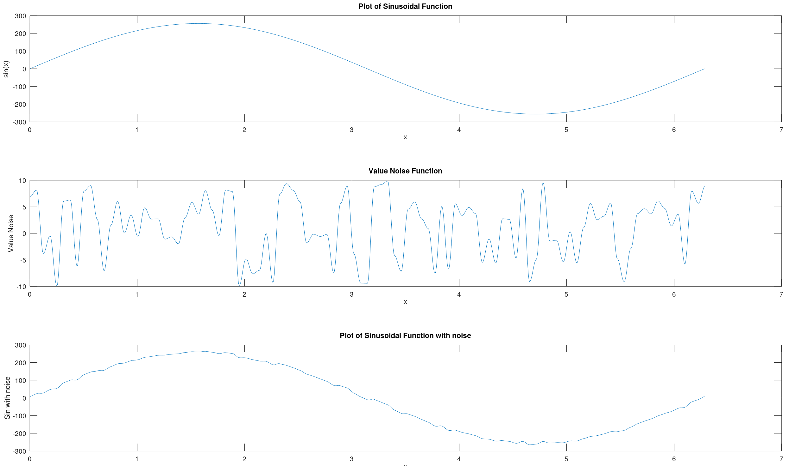

# Noise basics

## Table of Contents

- [What is Noise?](#what-is-noise)
    - [Noise Types](#noise-types)
- [Value Noise](#value-noise)
    - [How is it generated?](#how-is-it-generated)
    - [1D Value Noise](#1d-value-noise)
         - [Amplitude and Wavelength](#amplitude-and-wavelength)
    - [Octaves and composition (Fractal noise)](#octaves-and-composition-fractal-noise)
        - [Computation of Octaves](#computation-of-octaves)
        - [Composition of noise with other functions](#composition-of-noise-with-other-functions)
    - [2D Value Noise](#2d-value-noise)
- [Perlin Noise](#perlin-noise)
    - [How is Perlin Noise generated?](#how-is-perlin-noise-generated)
    - [1D Perlin Noise](#1d-perlin-noise)
    - [2D Perlin Noise](#2d-perlin-noise)
- [Noise in _Processing_](#noise-in-processing)

    
## What is Noise?

**"Noise"** refers to a random or pseudo-random signal that lacks any discernible pattern, but **mantains spatial coherence**. This noise is often used as a fundamental building block in generating natural-looking textures, patterns, or landscapes in computer graphics, simulations, and procedural content generation.

Keeping spatial coherence opposite to being a random signal is the most notable feature of a noise function, and rather than a less than accurate description, the best way to understand noise is to compare it with pure randomness values: 


In the image above the differences and applications of noise can be spotted. **Noise yields series of random values that have spatial continuity, opposite to pure randomness, where each value is completely independent from the previous one**

This spatial continuity, or coherence, has a lot of applications in computer graphics, it can be used to generate images and textures procedurally, surfaces, maps and clouds, among many examples. 

### Noise Types

There are many types of noise functions, most of them invented by [Ken Perlin](https://cs.nyu.edu/~perlin/). The most notable ones are

- **Perlin noise** is a type of gradient noise that uses value interpolation over a series of random values taking into account gradients over vertices.
- **Value Noise** was also invented by Ken Perlin, it can be seen as a simplification of perlin noise, instead of interpolating values using random gradients, it assigns random values to the vertices and interpolates the points within.  
- **Simplex Noise** was also developed by Ken Perlin as an improvement over Perlin noise, it is a type of gradient noise like Perlin noise. It has a lower computational complexity and is often faster to generate than Perlin noise.
Simplex noise produces similar natural-looking patterns with better properties in higher dimensions and reduced directional artifacts.
- **Worley Noise (Cellular Noise)**, also known as cellular noise, generates patterns based on the proximity of sample points to randomly distributed seed points or "cells.". It produces cell-like structures with regions of varying characteristics, such as Voronoi cells or "regions of influence."
Worley noise is useful for generating irregular patterns, textures, and terrain features.

Lastly, we can also encounter **fractal noise** in the literature, which is not a new noise function by itself, but a combination of the same function with different factors:

- **Fractal Noise**  refers to noise functions generated by combining multiple octaves of a base noise function at different frequencies and amplitudes. Each octave represents a layer of noise, with each subsequent octave having a higher frequency and lower amplitude. Fractal noise, such as fractal Brownian motion (fBm), is commonly used to generate complex, self-similar patterns resembling natural textures and phenomena.


We will focus on **value noise** and **perlin noise** in this docuemnt as they provide the basis to understand other noise functions. 

## Value Noise

Since I find value noise easier to understand, let's begin with it and we will continue with Perlin noise later. 

Typically, noise functions are signals that output values between `-1 and 1` and make use of a parameter named `frequency`.  This notation will be introduced when talking about Perlin noise, but in order to illustrate the properties of noise, value noise will be discussed taking into account the `amplitude` and `wavelength` - as I find that wavelength is easier to understand for someone starting in this topic than fequency is. 

### How is it generated?

Generating value noise involves assigning random values to a set of control points along a one-dimensional axis (1D) or two-dimensional grid (2D) and then interpolating between these values to obtain noise values at arbitrary points between the control points.

The outline of the algorithms is the following:

1. **Control Point Generation**:
First, we generate a set of control points along the one-dimensional axis. The number of control points depends on the desired resolution and the extent of the axis (this will be related to **wavelength** that will be introduce shortly). Each control point consists of a position (x-coordinate) and a random value (noise value) associated with that position.
2. **Random Value Assignment**:
At each control point, assign a random value (noise value) within a specified **amplitude** range. The random values assigned to the control points represent the "heights" or "intensities" of the noise at those positions along the axis or grid.
3. **Interpolation**:
Given a normal point (non control) between two adjacent control points (1D) or four of them (2D), interpolate between the noise values of these control points to obtain the noise value at the query point. 
4. **Smoothness and Continuity**:
The choice of interpolation method affects the smoothness and continuity of the resulting noise function.
Linear interpolation results in a piecewise-linear noise function with straight-line segments between control points. Cubic interpolation, on the other hand, produces a smoother noise function with curved segments between control points. It is recommended to use a cuadratic or cosine interpolation method at least to provide smoothness to the function. 
5. **Repeat for All Points**:
Repeat the interpolation process for all non control points along the axis (or grid) to generate the complete 1D (2D) value noise function. The density of query points determines the resolution and detail level of the generated noise function.

In order to be able to check the process in detail, I have also implemented the process in _Matlab_ in a separate folder. We will discern between the 1D case and 2D case. Let's see how we do it hands on, we will cover 1D value noise first and then extend to the 2D case.

### 1D Value noise

A basic sequence of value noise values can be generated with the following pseudocode:

```csharp
int wavelength  // The separation between points to be interpolated.
int amplitude   // The variability in height of the curve
int numPoints   // The number of points in the sequence. Ideally numPoints >>> wavelength

int[] yValues   // The array that will store the values of the curve

int valueStartWave = random(amplitude)
int valueEndWave = random(amplitude)

for(int currentPoint = 0; currentPoint < numPoints; currentPoint++)
{
    if(currentPoint % wavelength ==0)
    {
        // We have a control point. We set the values for the next wave
        valueStartWave = valueEndWave
        valueEndWave = random(amplitude)
        yValues[currentPoint] = valueStartWave
    }
    else
        // We interpolate the 
        yValues[currentPoint] = interpolate(valueStartWave, valueEndWave, currentPoint)
}
```

Instead of generating all the control points first and then interpolate the ones in the middle, what we do is process each one of the points, define the values of the relevant control points (`valueStartWave` and `valueEndWave`) and interpolate the ones that are not control points. 

File `valueNoise1D.m` in the matlab folder shows working code on how to generate 1D value noise.

####  Amplitude and Wavelength

Let's see how the different parameters behave when generating value noise. The **amplitude** expresses the value variability of the noise. This can be seen in the next figure:


You can see the plot of the same value noise distributions, with different _amplitudes_. 
- The <span style="color:blue">blue plot</span> has an amplitude of 120, so it varies from 60 to -60. 
- The <span style="color:green">green plot</span> has an amplitude of 80, so it varies from 40 to -40. 
- The <span style="color:red">red plot</span> has an amplitude of 40, so it varies from 20 to -20. 

The image has been generated with the script `valueNoiseAmplitudeSample` of the Matlab folder. 

Another thing we can spot in the sample above is that the noise function that is produced has the same behavior, it goes downwards and upwards on the same places, and changes slope at the same time. This is because the 3 have been generated with the **same seed** and have the **same wavelength** even if they have different amplitudes. 

The wavelenght of a value noise function is the distance between values to interpolate. In the sample above, the wavelength is 500, that means that the noise generates random values (_control values_) on positions 0, 500, 1000, 1500 and 2000, and the rest of the values are interpolations of the control values to the left and right. 

We can compare the effect of having different **wavelenghts** as we just did with the amplitudes:


Now you can see the plot of the same value noise distributions, with different _wavelengths_. 

- The <span style="color:red">red plot</span> has a wavelength of 500, so the control points are `0, 500, 1000, 1500, etc.`
- The <span style="color:blue">blue plot</span> has a wavelength of 250, so the control points are `0, 250, 500, 750, etc.`
- The <span style="color:green">green plot</span> has a wavelength of 125, so the control points are `0, 125, 250, 375, etc.`

The wavelength tells the function which is the distance between random points. The shorter the wavelength, the more variability our noise function will have. 

In the image above though, you can tell that all the plots have the same values at the control points of the red plot (`0, 500, 1000, 1500, etc.`).  There are also crossings between the blue and green plots on the control points of the blue plot (`0, 250, 500, 750, etc.`). That is because the different wavelengths of the plots are multiple between them, so we ensure that the control points coincide. 

The wavelength is usually seen **as the level of detail, or granularity** of the noise. However, having a wavelength that is minimal (2 or 3) leads us to similar results as random noise. How can we build noise function that keep the smoothness of the plot we have seen with larger wavelength and show little fluctuations in detail?

### Octaves and composition (Fractal noise)

We are managing the noise functions using `wavelength` and `amplitude` as main control parameters. The noise distributions we have been getting range from very smooth and continuous functions (with bigger amplitude and wavelength vlaues) to more variable ones (with smaller wavelength values)

What if we want to get the best of both worlds? We would like for instance to get a noise function that has a higher level continuity but at the same time, low level variability, to make it more spicy. How could we attain that? 

The answer is **octaves and composition**. 

- Octaves are a component of a noise function that contribute to the overall result.  
- Composition of octaves refers to the process of summing the values of all octaves in each point, to get the final noise value. 

Controlling the wavelength and amplitude will allow us to build noise that is consistent on different scale levels. An image will help much more than an explanation:


The image shows 2 plots. The image above plots each of the 4 octaves that contribute to the final noise function, plotted in black in the image below:

- The <span style="color:red">red plot</span> has `wavelength = 500 ; amplitude = 120`. The control points are multiple of 500 and the value ranges from -60 to 60.
- The <span style="color:blue">blue plot</span> has `wavelength = 250 ; amplitude = 60`. The control points are multiple of 250 and the value ranges from -30 to 30.
- The <span style="color:green">green plot</span> has `wavelength = 125 ; amplitude = 40`. The control points are multiple of 125 and the value ranges from -20 to 20.
- The <span style="color:magenta">magenta plot</span> has `wavelength = 10 ; amplitude = 5`.  The control points are multiple of 10 and the value ranges from -2.5 to 2.5.

The image below is the **result of adding up all the octave to one noise fucntion**. Different octaves contribute to the general behavior of the noise function. In the example above, we can see that the overall behavior of the function is driven by the red octave (the one with more wavelength), that is affected by the blue and green octaves to make it less uniform. Finally, the magenta plot adds up low level noise to the function. 

#### Computation of Octaves

To speak about that, we will introduce here the term **frequency** as it is commonly used among the literature and we should be familiar enough with wavelength and amplitude. 

```
frequency = 1 / wavelength
```
Ok, so frequecy is the inverse of wavelength (little surprise about that, since this is signal processing 101). What does it mean? 

Frequency tells us **how often we encounter a control point**, or **how much space do we have between control points**.

A frequency of 1 would tell us that _every point is a control point_, while a frequency of `1/500 = 0.002` would tell us that we have a control point every 500 points (wavelength = 500).

In most of the articles online, frequency is used to talk about noise and octaves, so just be aware that frequency is just another way to refer to wavelength. Now on to octaves.

Each octave represents a noise function at a different frequency and amplitude. Higher-frequency (lower wavelength) octaves have more rapid changes in values, while lower-frequency (higher wavelength) octaves have smoother transitions. Similarly, higher-amplitude octaves contribute more to the overall noise function's amplitude, while lower-amplitude octaves have less influence.

The term "octave" originates from music theory, where octaves represent doubling or halving of frequency. In the context of noise functions, each octave typically has a frequency that is twice that of the previous octave, and its amplitude is typically halved. This scaling allows for the creation of noise functions with a wide range of scales and levels of detail.

To generate fractal noise, multiple octaves of a base noise function (e.g., Perlin noise or value noise) are combined by adding them together. The contribution of each octave is determined by its **frequency**, **amplitude**, and **persistence** (a factor controlling how quickly the amplitude decreases with each successive octave).

In order to generate a composition of noise from octaves, we generally do the following (pseudocode):

```csharp
int initial_frequency   // Starting frquency (wavelength)
int intial_amplitude    // Starting amplitude
int persistance         // Factor that is applied between octaves 
int num_octaves         // number of octaves to calculate

int num_Points          // The number of points in the sequence. Ideally numPoints >>> wavelength
int[] yValues           // The array that will store the values of the curve

int frequency = initial_frequency
int amplitude = initial_amplitude

for(int octave = 0; octave < num_octaves; octave++)
{
   int[] octave_noise = noise(num_Points, frequency, amplitude)   

   yValues   += octave_noise    // This is an actual sum by elements
   frequency *= persistance
   amplitude /= persistance
}

return yValues;
```

#### Composition of noise with other functions

Noise can be composed or combined with any type of function, not only among octaves. We can use noise to add a little of variability to a known function, or to simulate effects such as to hand draw a square or a known shape. 

The idea is simple, we can add the noise value to the function that we want to distort a little bit. Find a simple example below on how noise can impact a known function, the *sine function* 



### 2D Value noise

## Perlin Noise

### How is Perlin Noise generated?

### 1D Perlin Noise

### 2D Perlin Noise


## Noise in Processing

https://github.com/silentDoc/processing_gfx/blob/main/NoiseTheory/images/valueNoise1dComp.png
https://github.com/silentDoc/processing_gfx/blob/main/NoiseTheory/images/valuenoise1dComp.png