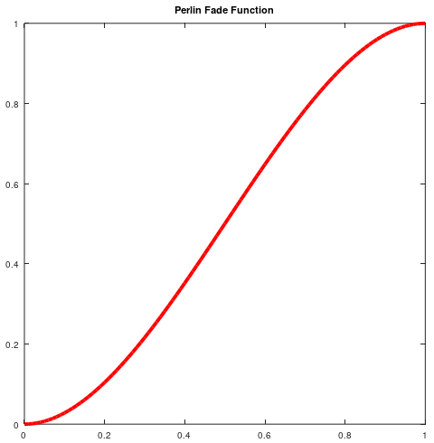
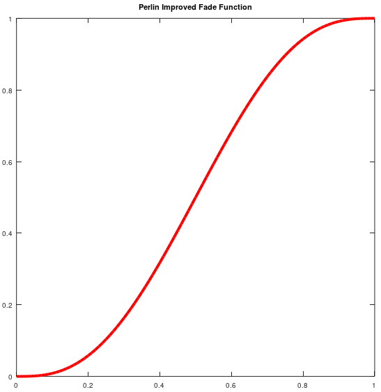

# Related topics and Applications
***
## Table of contents

- [Interpolation and fade functions](#interpolation-and-fade-functions)
    - [Linear interpolation](#linear-interpolation)
    - [Cosine interpolation](#cosine-interpolation)
    - [Original Perlin Fade Function](#original-perlin-fade-function)
    - [Improved Perlin Fade Function](#improved-perlin-fade-function)
    - [Properties of the Fade Functions](#properties-of-the-fade-functions)
        - [Number of necessary known values](#number-of-necessary-known-values)
        - [First order derivative](#first-order-derivative)
        - [Second order derivative](#second-order-derivative)
    - [Comparison of interpolators](#comparison-of-interpolators)

- [Composition and textures](#composition-and-textures)
    - [Octaves](#octaves)
    - [Fractality](#fractality)
    - [Textures from noise](#textures-from-noise)
        - [Turbulence](#turbulence)
        - [Marble](#marble)
        - [Wood](#wood)
        - [Water](#water)
        - [Fire](#fire)
        - [Clouds](#clouds)

***

# Interpolation and Fade functions

When reviewing Value noise and Perlin noise, the use of interpolation methods  (or fade functions) is very important. They play a key role in one of the properties we are looking for in a noise function: **smoothness**.  

I think it is good to revisit these functions and understand them, where do they come from and why and how are they useful, as it is very likely that we use them in other scenarios that are not limited to the noise generation. 

An interpolation function can be defined as **a mathematical method to estimate or infer the value of a function at a given point `x_p` using other available values of this function at different points**. 

When generating noise, we use the interpolation method to find the values of all the positions inside a lattice (collection of `x_p`) using our available values of the function (the values of the noise at the lattice point).

To explore what the interpolation methods are about, we will assume a 1D signal interpolation with the following notation:
```math
\begin{aligned}
(x_0, y_0) &\qquad \text{The first interpolation point - lattice point}
\\[2ex]
(x_1, y_1) &\qquad \text{The second interpolation point - 2nd lattice point}
\\[2ex]
(x_p, y_p) &\qquad \text{The point to be interpolated}
\end{aligned}
```

Let's review 4 interpolation methods, the *linear interpolation* which is most basic one, and the *cosine interpolator* and Perlin's fade functions, that are the ones that are used to generate Value noise and Perlin noise. 

## Linear interpolation

Linear interpolation is the most basic interpolation method that provides continuous functions (the *nearest neighbor interpolator* is more basic but it yields non continuous signals). The basic assumption of this interpolator is that **the function we are trying to estimate is a line between two points**, so every estimated value will be in the line that goes between the first lattice value and the second:

```math
y_p = y_0 + (y_1 - y_0) \frac{x_p - x_0}{x_1 - x_0}
```

The linear interpolation function in the interval `(0,1)` looks like this:
<div style="width:50%; margin: auto;">
<p align="center" width='50%'>

</p>
</div>


## Cosine interpolation
To render value noise, I take advantage of the **cosine interpolation** method to interpolate a function between two points. I opt for that method because consine interpolators only need 2 data points to interpolate the ones in the middle, it is fast and simple and it provides a much more smoother transition than the basic linear interpolator. 

I have already discussed the implementation details of the cosine interpolator in the [value noise aricle](./valuenoise.md#how-is-it-generated), but just for quick comparison, the interpolation formula is the following:

```math
\begin{aligned}
angle &= x_p * \Pi  \qquad \qquad ;x_p \in (0,1)
\\[2ex]
w &= \frac{1 - \cos{(angle)}}{2}
\\[2ex]
y_p &= y_0*(1-w) + y_1 * w
\end{aligned}
```
The cosine interpolation function in the interval `(0,1)` looks like this:
<div style="width:50%; margin: auto;">
<p align="center" width='50%'>

</p>
</div>

Notice how the function is not a straight line from 0 to 1, but is has some degree of curve provided by the trigonometric function. That curve is the smooth factor that we can see in transition between lattices in our noise. 

## Original Perlin Fade Function
In his original article, Ken Perlin proposed the following fade function to be used along a linear interpolation. The function was really simple and looks like this:

```math
\begin{aligned}
w &= 3x_p^2 - 2x_p^3 \qquad \qquad ;x_p \in (0,1)
\\[2ex]
y_p &= y_0*(1-w) + y_1 * w
\end{aligned}
```
The function looks very similar to the cosine interpolation function:

<div style="width:50%; margin: auto;">
<p align="center" width='50%'>

</p>
</div>

Why did Ken Perlin come up with something so similar to existing interpolators?

Aside from the properties of the function itself that will be reviewed lated, I guess the answer has to be computational efficiency. The original article is from the 80s and back then we were used to count processor cycles to speed up things ;). 

Perlin original fade function can be computed like this:

```csharp
// 3x^2 - 2x^3
fade = x*x * (3 - 2*x);
```
Coding the fade function like this is efficient and does not use of any `cos` or other trigonometric programming instruction, wich were introduced in the 386 intel processor (after Perlin's article) and had to be solved using LUTs (indirecting memory was way slower than multiplying.)

The fade function though, does the trick, it provides results that depend only on two interpolation points and it also yields smooth transitions between lattices, and as you can observe the function output is almost identical to the cosine interpolator, yet much more efficient from a computation standpoint (especially in the 80s). 

## Improved Perlin Fade Function

In his second article, _Improving Noise_, 2002, Perlin revisits his original algorithms and makes 2 substantial changes. The first one has to do with the gradients and noise generation and has been reviewed in th [Perlin noise entry](./perlinnoise.md), but the second is a replacement of his original fade function. 

Perlin proposes:

```math
w = 6x_p^5 - 15x_p^4 + 10x_p^3 \qquad \qquad ;x_p \in (0,1)
```
instead of his original

```math
w = 3x_p^2 - 2x_p^3 \qquad \qquad \qquad ;x_p \in (0,1)
```
<br/>

The motivation of this change is that Perlin observed that his original fade functions produced noise artifacts due to the properties of the second derivative of the original fade function, this will be detailed in the [properties subsection](#properties-of-the-fade-functions).

The improved fade function looks very similar to the cosine and original interpolators, but it is a little bit more smoother on the values around 0 and 1.

<div style="width:50%; margin: auto;">
<p align="center" width='50%'>

</p>
</div>

From a computation standpoint, this polynomic interpolator can also be optimized to compute fastly - but in 2002 (article date), the processor speeds were way faster than in the 80s, so there was no risk of performance hiccups. 

Most of the implementations follow the same idea of the original fade function

```csharp
// 6x^5 - 15x^4 + 10x^3
fade_improved = x*x*x * (10 + x*(-15 + 6*x));
```

Nowadays, it makes little sense to use the original fade function since the improved version has better properties and does not pose a problem from the performance point of view. 

## Properties of the Fade Functions

### Number of necessary known values

### First order derivative

### Second order derivative

## Comparison of interpolators

***
# Composition and textures


## Octaves

In most of the articles online, frequency is used to talk about noise and octaves, so just be aware that frequency is just another way to refer to wavelength. Now on to octaves.

Each octave represents a noise function at a different frequency and amplitude. Higher-frequency (lower wavelength) octaves have more rapid changes in values, while lower-frequency (higher wavelength) octaves have smoother transitions. Similarly, higher-amplitude octaves contribute more to the overall noise function's amplitude, while lower-amplitude octaves have less influence.

The term "octave" originates from music theory, where octaves represent doubling or halving of frequency. In the context of noise functions, each octave typically has a frequency that is twice that of the previous octave, and its amplitude is typically halved. This scaling allows for the creation of noise functions with a wide range of scales and levels of detail.

To generate fractal noise, multiple octaves of a base noise function (e.g., Perlin noise or value noise) are combined by adding them together. The contribution of each octave is determined by its **frequency**, **amplitude**, and **persistence** (a factor controlling how quickly the amplitude decreases with each successive octave).

In order to generate a composition of noise from octaves, we generally do the following (pseudocode):

```csharp
int initial_frequency   // Starting frquency (wavelength)
int intial_amplitude    // Starting amplitude
int persistance         // Factor that is applied between octaves 
int num_octaves         // number of octaves to calculate

int num_Points          // The number of points in the sequence. Ideally numPoints >>> wavelength
int[] yValues           // The array that will store the values of the curve

int frequency = initial_frequency
int amplitude = initial_amplitude

for(int octave = 0; octave < num_octaves; octave++)
{
   int[] octave_noise = noise(num_Points, frequency, amplitude)   

   yValues   += octave_noise    // This is an actual sum by elements
   frequency *= persistance
   amplitude /= persistance
}

return yValues;
```
## Fractality

The resulting noise function from combining a set of octaves is called **Fractal Browsian noise (fBn)**

Fractal Brownian Noise (fBm) is a type of fractal noise that is commonly used in computer graphics, procedural generation, and simulations to generate complex and realistic-looking textures, terrains, and patterns. It is an extension of Perlin/Value noise and other types of gradient noise.

Here's a breakdown of the key characteristics and components of Fractal Brownian Noise:

- **Fractal Nature:**
Fractal Brownian Noise exhibits self-similarity across multiple scales, meaning that the noise pattern looks similar regardless of the level of detail at which it is viewed.
This self-similarity allows for the creation of natural-looking textures and terrains with intricate detail.
- **Brownian Motion:**
Fractal Brownian Noise is based on the concept of Brownian motion, which describes the random movement of particles in a fluid or gas. In the context of noise generation, Brownian motion refers to the cumulative effect of combining multiple layers (octaves) of noise with varying frequencies and amplitudes.
- **Octaves:**
Fractal Brownian Noise combines multiple octaves of a base noise function, such as Perlin noise or value noise.
Each octave represents a layer of noise with a different frequency and amplitude. Higher-frequency octaves contribute fine detail to the overall noise pattern, while lower-frequency octaves contribute broader features.
- **Persistence:**
Persistence is a parameter that controls the influence of each successive octave on the final noise output. A higher persistence value results in stronger influence from higher-frequency octaves, leading to more detailed and "noisy" output. Lower persistence values produce smoother noise patterns with less high-frequency detail.
- **Generation Process:**
Fractal Brownian Noise is generated by summing together multiple octaves of noise, each scaled by a factor determined by its frequency and persistence. The noise values from each octave are added together to produce the final output, which exhibits characteristics of both randomness and structure.

In summary, Fractal Brownian Noise is a type of fractal noise that combines multiple layers of noise with varying frequencies and amplitudes to create complex, self-similar patterns.


## Textures from noise

### Turbulence
### Marble
### Wood
### Water
### Fire
### Clouds
