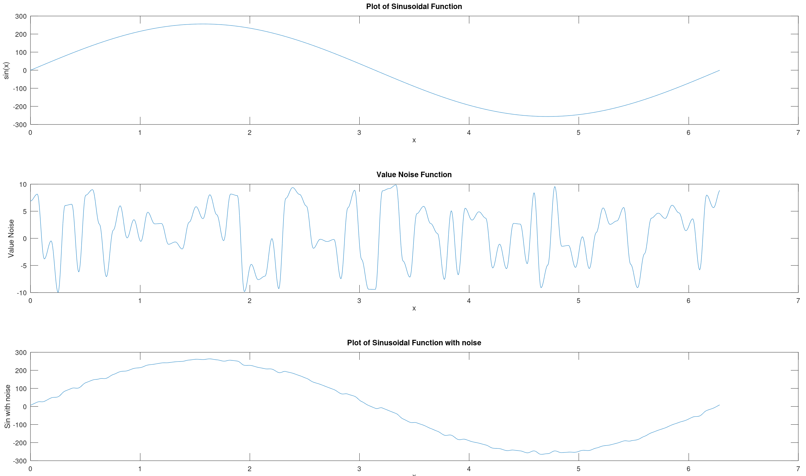

# Value Noise Theory

## Table of Contents

- [Value Noise](#value-noise)
    - [How is it generated?](#how-is-it-generated)
    - [1D Value Noise](#1d-value-noise)
         - [Amplitude and Wavelength](#amplitude-and-wavelength)
    - [Octaves and composition (Fractal noise)](#octaves-and-composition-fractal-noise)
        - [Computation of Octaves](#computation-of-octaves)
        - [Fractal Brownian Noise](#fractal-brownian-noise)
        - [Composition of noise with other functions](#composition-of-noise-with-other-functions)
    - [2D Value Noise](#2d-value-noise)
- [Perlin Noise](#perlin-noise)
    - [How is Perlin Noise generated?](#how-is-perlin-noise-generated)
    - [1D Perlin Noise](#1d-perlin-noise)
    - [2D Perlin Noise](#2d-perlin-noise)
- [Noise in _Processing_](#noise-in-processing)


## Value Noise

Since I find value noise easier to understand, let's begin with it and we will continue with Perlin noise later. 

Value noise is a smooth, continuous pseudo random function that yields values that range within a given `amplitude`. The function is built upon a set of points called `lattice points` that have a random value within range. The distance between lattice points will be called ´wavelength´. The rest of points that fall bewteen lattice points have a value that results from an interpolation of the lattice points that bound it. 

In the literature, noise functions are typically signals that output values between `-1 and 1` and make use of a parameter named `frequency`.  This notation will be later introduced when talking about Perlin noise, but in order to illustrate the properties of noise, value noise will be discussed first taking into account the `amplitude` and `wavelength` - as I find that wavelength is easier to understand for someone starting in this topic than fequency is, and value noise is also simpler to implement and understand. 

### How is it generated?

Generating value noise involves assigning random values to a set of lattice points along a one-dimensional axis (1D) or two-dimensional grid (2D) and then interpolating between these values to obtain noise values at arbitrary points between the lattice points.

The outline of the algorithms is the following:

1. **Lattice point Generation**:
First, we generate a set of lattice points along the one-dimensional axis. The number of lattice points depends on the desired resolution and the extent of the axis (this will be related to **wavelength** that will be introduce shortly). Each lattice point consists of a position (x-coordinate) and a random value (noise value) associated with that position.
2. **Random Value Assignment**:
At each lattice point, assign a random value (noise value) within a specified **amplitude** range. The random values assigned to the lattice points represent the "heights" or "intensities" of the noise at those positions along the axis or grid.
3. **Interpolation**:
Given a normal point (non lattice) between two adjacent lattice points (1D) or four of them (2D), interpolate between the noise values of these lattice points to obtain the noise value at the query point. 
4. **Smoothness and Continuity**:
The choice of interpolation method affects the smoothness and continuity of the resulting noise function.
Linear interpolation results in a piecewise-linear noise function with straight-line segments between lattice points. Cubic interpolation, on the other hand, produces a smoother noise function with curved segments between lattice points. It is recommended to use a cuadratic or cosine interpolation method at least to provide smoothness to the function. 
5. **Repeat for All Points**:
Repeat the interpolation process for all non lattice points along the axis (or grid) to generate the complete 1D (2D) value noise function. The density of query points determines the resolution and detail level of the generated noise function.

In order to be able to check the process in detail, I have also implemented the process in _Matlab_ in a separate folder. We will discern between the 1D case and 2D case. Let's see how we do it hands on, we will cover 1D value noise first and then extend to the 2D case.

To see this working step by step, we describe the process next, with images:

´´´
Assume we want to generate value noise over 1000 points
Wavelength = 100
Amplitude = 100
´´´

As mentioned, wavelength will set the distance between lattice points. 

- **Steps 1 and 2 - Lattice point Generation and random value assignment**:


In this step we create lattice points and assign random values to them. The lattice point positions are defined by the `wavelength` parameter, and their value is random. 
<br/>

- **Steps 3 and 4 - Interpolation and smoothness and continuity**:

Once the lattice points are defined, we start interpolating all the noise values that lie between lattice points unsing an interpolation function. In the image below, the first segment has been interpolated. 


The interpolation method that I will be using for all the **value noise** section is the `cosine interpolation`, a rather simple interpolation method that yields better results than the linear interpolation and works like this:

```csharp
// Given a point x between lattice start position x0 and lattice end position x1 ; with x0 < x < x1
// Given the values of noise y0 at x0  and y1 at x1
// Given wavelength = length of the lattice = x1-x0

normalized_position = mod(x, wavelength) /  wavelength     // ranges (0,1)
angle = normalized_position * PI
weight = (1 - cos(angle)) * 0.5

value_at_x = y1 * (1-weight) + y0*weight
```

The interpolation function will be a topic that will be deeply discussed when we reach the perlin noise, just bear in mind for now that an interpolation method will provide values that form a continuous function between lattice points. 

Another feature that we want to obtain is the continuity and smoothness between lattices and smoothness. The cosine interpolator yields better results than a linear interpolator, providing results like this one:


<br/>
<br/>

- **Step 5 - Repeat for all points**:

We repeat the interpolations for all the points we want to obtain, taking into account the lattice in which each point lies and we finally get the noise function:


<br/>

This process can be found on the script: `valueNoise1DStepByStep.m` of the matlab folder


<br/>
<br/>

### 1D Value noise

A basic sequence of value noise values can be generated with the following pseudocode:

```csharp
int wavelength  // The separation between lattice points
int amplitude   // The variability in height of the curve
int numPoints   // The number of points in the sequence. Ideally numPoints >>> wavelength

int[] yValues   // The array that will store the values of the curve

int valueStartWave = random(amplitude)
int valueEndWave = random(amplitude)

for(int currentPoint = 0; currentPoint < numPoints; currentPoint++)
{
    if(currentPoint % wavelength ==0)
    {
        // We have a lattice point. We set the values for the next wave
        valueStartWave = valueEndWave
        valueEndWave = random(amplitude)
        yValues[currentPoint] = valueStartWave
    }
    else
        // We interpolate the 
        yValues[currentPoint] = interpolate(valueStartWave, valueEndWave, currentPoint)
}
```

Instead of generating all the lattice points first and then interpolate the ones in the middle, what we do is process each one of the points, define the values of the relevant lattice points (`valueStartWave` and `valueEndWave`) and interpolate the ones that are not lattice points. 

File `valueNoise1D.m` in the matlab folder shows working code on how to generate 1D value noise.

####  Amplitude and Wavelength

Let's see how the different parameters behave when generating value noise. The **amplitude** expresses the value variability of the noise. This can be seen in the next figure:


You can see the plot of the same value noise distributions, with different _amplitudes_. 
- The <span style="color:blue">blue plot</span> has an amplitude of 120, so it varies from 60 to -60. 
- The <span style="color:green">green plot</span> has an amplitude of 80, so it varies from 40 to -40. 
- The <span style="color:red">red plot</span> has an amplitude of 40, so it varies from 20 to -20. 

The image has been generated with the script `valueNoiseAmplitudeSample` of the Matlab folder. 

Another thing we can spot in the sample above is that the noise function that is produced has the same behavior, it goes downwards and upwards on the same places, and changes slope at the same time. This is because the 3 have been generated with the **same seed** and have the **same wavelength** even if they have different amplitudes. 

The wavelenght of a value noise function is the distance between values to interpolate. In the sample above, the wavelength is 500, that means that the noise generates random values (lattice values_) on positions 0, 500, 1000, 1500 and 2000, and the rest of the values are interpolations of the lattice values to the left and right. 

We can compare the effect of having different **wavelenghts** as we just did with the amplitudes:


Now you can see the plot of the same value noise distributions, with different _wavelengths_. 

- The <span style="color:red">red plot</span> has a wavelength of 500, so the lattice points are `0, 500, 1000, 1500, etc.`
- The <span style="color:blue">blue plot</span> has a wavelength of 250, so the lattice points are `0, 250, 500, 750, etc.`
- The <span style="color:green">green plot</span> has a wavelength of 125, so the lattice points are `0, 125, 250, 375, etc.`

The wavelength tells the function which is the distance between random points. The shorter the wavelength, the more variability our noise function will have. 

In the image above though, you can tell that all the plots have the same values at the lattice points of the red plot (`0, 500, 1000, 1500, etc.`).  There are also crossings between the blue and green plots on the lattice points of the blue plot (`0, 250, 500, 750, etc.`). That is because the different wavelengths of the plots are multiple between them, so we ensure that the lattice points coincide. 

The wavelength is usually seen **as the level of detail, or granularity** of the noise. However, having a wavelength that is minimal (2 or 3) leads us to similar results as random noise. How can we build noise function that keep the smoothness of the plot we have seen with larger wavelength and show little fluctuations in detail?

### Octaves and composition (Fractal Brownian noise)

We are managing the noise functions using `wavelength` and `amplitude` as main lattice parameters. The noise distributions we have been getting range from very smooth and continuous functions (with bigger amplitude and wavelength vlaues) to more variable ones (with smaller wavelength values)

What if we want to get the best of both worlds? We would like for instance to get a noise function that has a higher level continuity but at the same time, low level variability, to make it more spicy. How could we attain that? 

The answer is **octaves and composition**. 

- Octaves are a component of a noise function that contribute to the overall result.  
- Composition of octaves refers to the process of summing the values of all octaves in each point, to get the final noise value. 

Controlling the wavelength and amplitude will allow us to build noise that is consistent on different scale levels. An image will help much more than an explanation:


The image shows 2 plots. The image above plots each of the 4 octaves that contribute to the final noise function, plotted in black in the image below:

- The <span style="color:red">red plot</span> has `wavelength = 500 ; amplitude = 120`. The lattice points are multiple of 500 and the value ranges from -60 to 60.
- The <span style="color:blue">blue plot</span> has `wavelength = 250 ; amplitude = 60`. The lattice points are multiple of 250 and the value ranges from -30 to 30.
- The <span style="color:green">green plot</span> has `wavelength = 125 ; amplitude = 40`. The lattice points are multiple of 125 and the value ranges from -20 to 20.
- The <span style="color:magenta">magenta plot</span> has `wavelength = 10 ; amplitude = 5`.  The lattice points are multiple of 10 and the value ranges from -2.5 to 2.5.

The image below is the **result of adding up all the octave to one noise fucntion**. Different octaves contribute to the general behavior of the noise function. In the example above, we can see that the overall behavior of the function is driven by the red octave (the one with more wavelength), that is affected by the blue and green octaves to make it less uniform. Finally, the magenta plot adds up low level noise to the function. 

#### Computation of Octaves

To speak about that, we will introduce here the term **frequency** as it is commonly used among the literature and we should be familiar enough with wavelength and amplitude. 

```
frequency = 1 / wavelength
```
Ok, so frequecy is the inverse of wavelength. What does it mean? 

Frequency tells us **how often we encounter a lattice point**, or **how much space do we have between lattice points**.

A frequency of 1 would tell us that _every point is a lattice point_, while a frequency of `1/500 = 0.002` would tell us that we have a lattice point every 500 points (wavelength = 500).

In most of the articles online, frequency is used to talk about noise and octaves, so just be aware that frequency is just another way to refer to wavelength. Now on to octaves.

Each octave represents a noise function at a different frequency and amplitude. Higher-frequency (lower wavelength) octaves have more rapid changes in values, while lower-frequency (higher wavelength) octaves have smoother transitions. Similarly, higher-amplitude octaves contribute more to the overall noise function's amplitude, while lower-amplitude octaves have less influence.

The term "octave" originates from music theory, where octaves represent doubling or halving of frequency. In the context of noise functions, each octave typically has a frequency that is twice that of the previous octave, and its amplitude is typically halved. This scaling allows for the creation of noise functions with a wide range of scales and levels of detail.

To generate fractal noise, multiple octaves of a base noise function (e.g., Perlin noise or value noise) are combined by adding them together. The contribution of each octave is determined by its **frequency**, **amplitude**, and **persistence** (a factor controlling how quickly the amplitude decreases with each successive octave).

In order to generate a composition of noise from octaves, we generally do the following (pseudocode):

```csharp
int initial_frequency   // Starting frquency (wavelength)
int intial_amplitude    // Starting amplitude
int persistance         // Factor that is applied between octaves 
int num_octaves         // number of octaves to calculate

int num_Points          // The number of points in the sequence. Ideally numPoints >>> wavelength
int[] yValues           // The array that will store the values of the curve

int frequency = initial_frequency
int amplitude = initial_amplitude

for(int octave = 0; octave < num_octaves; octave++)
{
   int[] octave_noise = noise(num_Points, frequency, amplitude)   

   yValues   += octave_noise    // This is an actual sum by elements
   frequency *= persistance
   amplitude /= persistance
}

return yValues;
```

The resulting noise function from combining a set of octaves is called **Fractal Browsian noise (fBn)**

#### Fractal Brownian Noise

Fractal Brownian Noise (fBm) is a type of fractal noise that is commonly used in computer graphics, procedural generation, and simulations to generate complex and realistic-looking textures, terrains, and patterns. It is an extension of Perlin/Value noise and other types of gradient noise.

Here's a breakdown of the key characteristics and components of Fractal Brownian Noise:

- **Fractal Nature:**
Fractal Brownian Noise exhibits self-similarity across multiple scales, meaning that the noise pattern looks similar regardless of the level of detail at which it is viewed.
This self-similarity allows for the creation of natural-looking textures and terrains with intricate detail.
- **Brownian Motion:**
Fractal Brownian Noise is based on the concept of Brownian motion, which describes the random movement of particles in a fluid or gas. In the context of noise generation, Brownian motion refers to the cumulative effect of combining multiple layers (octaves) of noise with varying frequencies and amplitudes.
- **Octaves:**
Fractal Brownian Noise combines multiple octaves of a base noise function, such as Perlin noise or value noise.
Each octave represents a layer of noise with a different frequency and amplitude. Higher-frequency octaves contribute fine detail to the overall noise pattern, while lower-frequency octaves contribute broader features.
- **Persistence:**
Persistence is a parameter that controls the influence of each successive octave on the final noise output. A higher persistence value results in stronger influence from higher-frequency octaves, leading to more detailed and "noisy" output. Lower persistence values produce smoother noise patterns with less high-frequency detail.
- **Generation Process:**
Fractal Brownian Noise is generated by summing together multiple octaves of noise, each scaled by a factor determined by its frequency and persistence. The noise values from each octave are added together to produce the final output, which exhibits characteristics of both randomness and structure.

In summary, Fractal Brownian Noise is a type of fractal noise that combines multiple layers of noise with varying frequencies and amplitudes to create complex, self-similar patterns.

#### Composition of noise with other functions

Noise can be composed or combined with any type of function, not only among octaves. We can use noise to add a little of variability to a known function, or to simulate effects such as to hand draw a square or a known shape. 

The idea is simple, we can add the noise value to the function that we want to distort a little bit. Find a simple example below on how noise can impact a known function, the *sine function* 




You may have seen this on some sketching programs, where lines and circles look like this (the captures are from a sketching program called [Pencil](https://pencil.evolus.vn/)):


<br/>
<br/>

### 2D Value noise

2D value noise is a natural extension of 1D value noise. In the 1D case, `we generate noise values Y over the axis X`, in the 2D case, `we generate noise values Z over the a grid formed by axis XY`.

The results can be seen also as an extrapolation of the 1D case. Instead of having a 2D function X-Noise we will now have a 3D function XY-Noise, as can be seen here:


2D noise can also be interpreted as an image, where each pixel has a value (noise). This take helps us to understand even better the diference between noise and randomness:


