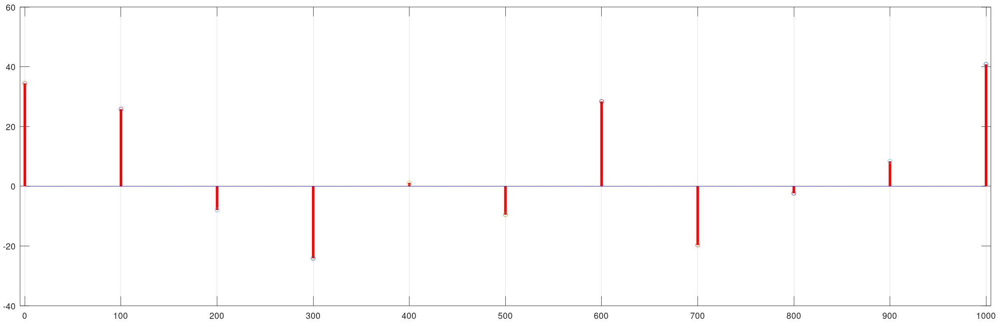
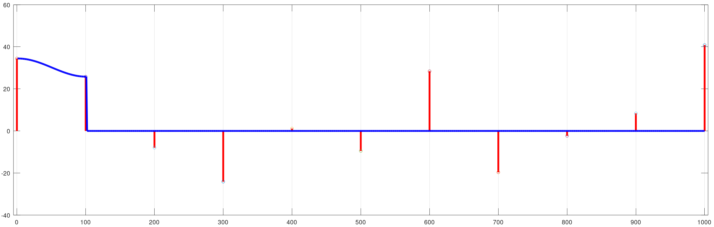
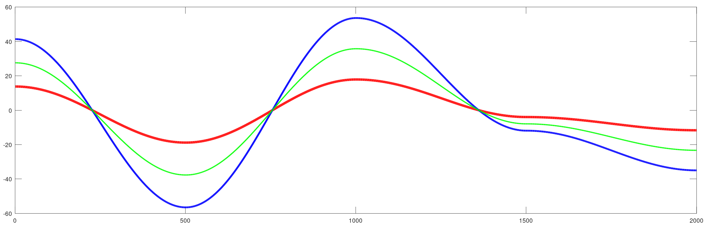
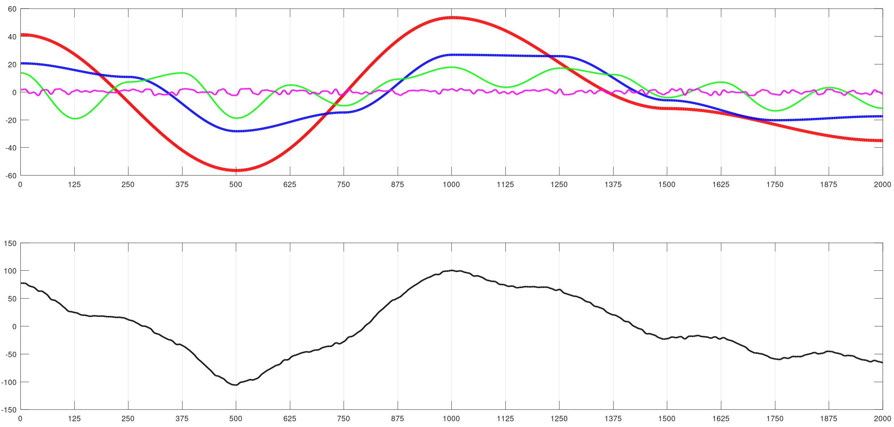
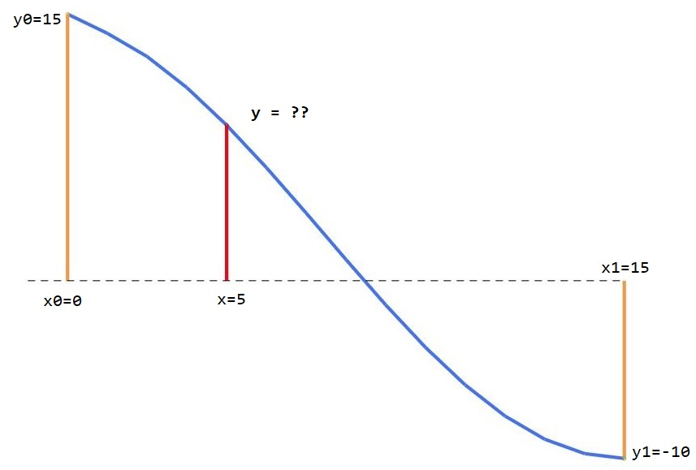
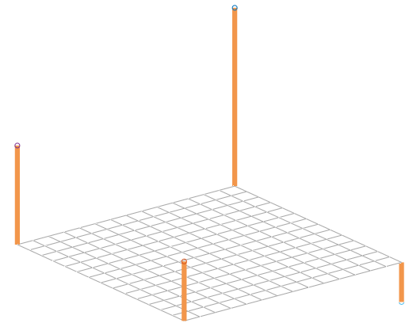
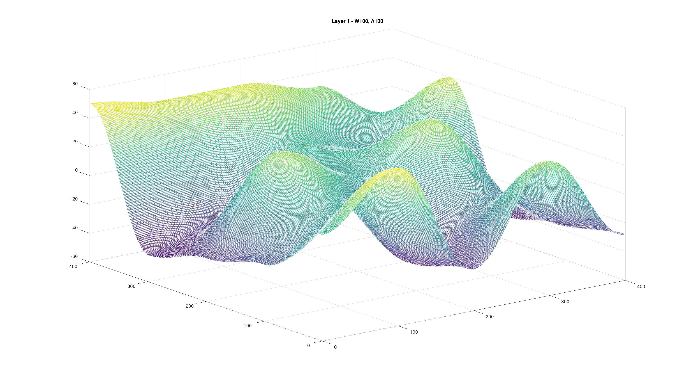
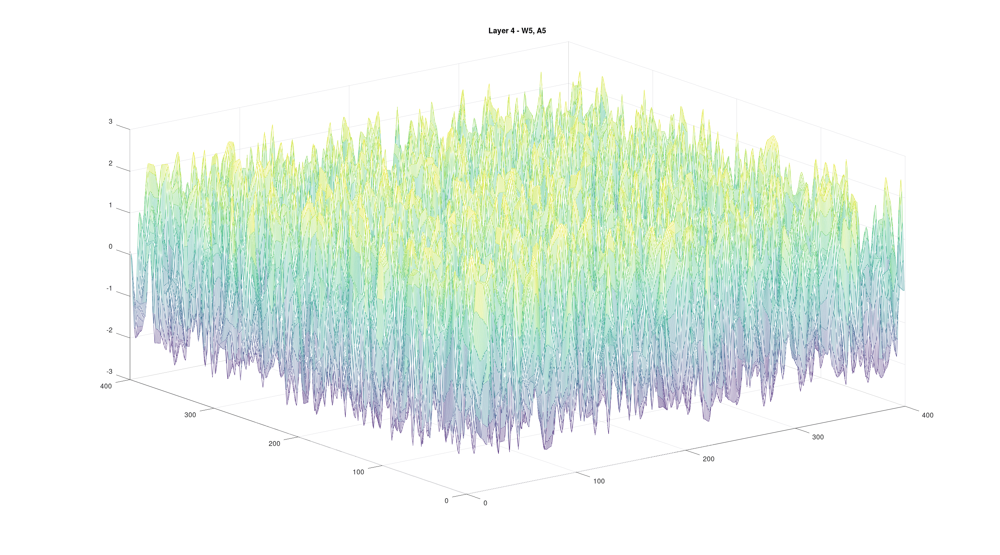

# Value Noise Basics

## Table of Contents

- [Value Noise](#value-noise)
    - [How is it generated?](#how-is-it-generated)
    - [1D Value Noise](#1d-value-noise)
         - [Amplitude and Wavelength](#amplitude-and-wavelength)
    - [Value noise composition (Brownian Value noise)](#value-noise-composition-brownian-value-noise)
        - [Computation of Layers](#computation-of-layers)
        - [Composition of noise with other functions](#composition-of-noise-with-other-functions)
    - [2D Value Noise](#2d-value-noise)
      - [How is 2D Noise generated?](#how-is-2D-noise-generated)
        - [2D bilinear interpolation (but using cosines)](#2D-bilinear-interpolation-but-using-cosines)
      - [Composition of 2D Value Noise](#composition-of-2D-value-noise)
      - [Wrap up](#wrap-up)


[Back to noise index](readme.md)

<br/>

## Value Noise

Since I find value noise easier to understand, let's begin with it and we will continue with Perlin noise later. 

Value noise is a smooth, continuous pseudo random function that yields values that range within a given `amplitude`. The function is built upon a set of points called `lattice points` that have a random value within amplitude range. The distance between lattice points will be called `wavelength`. The rest of points that fall bewteen lattice points have a value that results from an interpolation of the lattice points that bound it. 

In the literature, noise functions are typically signals that output values between `-1 and 1` and make use of a parameter named `frequency`.  This notation will be later introduced when talking about Perlin noise, but in order to illustrate the properties of noise, value noise will be discussed first taking into account the `amplitude` and `wavelength` - as I find that wavelength is easier to understand for someone starting in this topic than fequency is, and value noise is also simpler to implement and understand. 

### How is it generated?

Generating value noise involves assigning random values to a set of lattice points along a one-dimensional axis (1D) or two-dimensional grid (2D) and then interpolating between these values to obtain noise values at arbitrary points between the lattice points.

The outline of the algorithms is the following:

1. **Lattice point Generation**:
First, we generate a set of lattice points along the one-dimensional axis. The number of lattice points depends on the desired resolution and the extent of the axis (this will be related to **wavelength** that will be introduce shortly). Each lattice point consists of a position (x-coordinate) and a random value (noise value) associated with that position.
2. **Random Value Assignment**:
At each lattice point, assign a random value (noise value) within a specified **amplitude** range. The random values assigned to the lattice points represent the "heights" or "intensities" of the noise at those positions along the axis or grid.
3. **Interpolation**:
Given a normal point (non lattice) between two adjacent lattice points (1D) or four of them (2D), interpolate between the noise values of these lattice points to obtain the noise value at the query point. 
4. **Smoothness and Continuity**:
The choice of interpolation method affects the smoothness and continuity of the resulting noise function.
Linear interpolation results in a piecewise-linear noise function with straight-line segments between lattice points. Cubic interpolation, on the other hand, produces a smoother noise function with curved segments between lattice points. It is recommended to use a cuadratic or cosine interpolation method at least to provide smoothness to the function. 
5. **Repeat for All Points**:
Repeat the interpolation process for all non lattice points along the axis (or grid) to generate the complete 1D (2D) value noise function. The density of query points determines the resolution and detail level of the generated noise function.

In order to be able to check the process in detail, I have also implemented the process in _Matlab_ (or _Octave_) in a separate folder. We will discern between the 1D case and 2D case. Let's see how we do it hands on, we will cover 1D value noise first and then extend to the 2D case.

To see this working step by step, we describe the process next, with images:

```
Assume we want to generate value noise over 1000 points
Wavelength = 100
Amplitude = 100
```

As mentioned, wavelength will set the distance between lattice points. 

- **Steps 1 and 2 - Lattice point Generation and random value assignment**:

<p align="center">

</p>

In this step we create lattice points and assign random values to them. The lattice point positions are defined by the `wavelength` parameter, and their value is random. 
<br/>

- **Steps 3 and 4 - Interpolation and smoothness and continuity**:

Once the lattice points are defined, we start interpolating all the noise values that lie between lattice points unsing an interpolation function. In the image below, the first segment has been interpolated. 

<p align="center">

</p>

The interpolation method that I will be using for all the **value noise** section is the `cosine interpolation`, a rather simple interpolation method that yields better results than the linear interpolation and works like this:

```csharp
// Given a point x between lattice start position x0 and lattice end position x1 ; with x0 < x < x1
// Given the values of noise y0 at x0  and y1 at x1
// Given wavelength = length of the lattice = x1-x0

normalized_position = mod(x, wavelength) /  wavelength     // ranges (0,1)
angle = normalized_position * PI
weight = (1 - cos(angle)) * 0.5

value_at_x = y1 * (1-weight) + y0*weight
```

The interpolation function will be a topic that will be deeply discussed when we reach the perlin noise, just bear in mind for now that an interpolation method will provide values that form a continuous function between lattice points. 

Another feature that we want to obtain is the continuity and smoothness between lattices and smoothness. The cosine interpolator yields better results than a linear interpolator, providing results like this one:

<p align="center">

</p>

I am choosing the cosine interpolator for now because it only depends on the 2 lattice points that bound the point to be interpolated and it is easily extensible in the 2D case. But the interpolation used on perlin noise is not the cosine interpolator as we will see. Just bear in mind that the use of `cosine interpolation` is a decision I made as a tradeoff of simplicity and acceptable results for now. 

<br/>

- **Step 5 - Repeat for all points**:

We repeat the interpolations for all the points we want to obtain, taking into account the lattice in which each point lies and we finally get the noise function:

<p align="center">

</p>

```
This process can be found on the script: `valueNoise1DStepByStep.m` of the matlab folder
```


<br/>

### 1D Value noise

A basic sequence of value noise values can be generated with the following pseudocode:

```csharp
int wavelength  // The separation between lattice points
int amplitude   // The variability in height of the curve
int numPoints   // The number of points in the sequence. Ideally numPoints >>> wavelength

int[] yValues   // The array that will store the values of the curve

int valueStartWave = random(amplitude)
int valueEndWave = random(amplitude)

for(int currentPoint = 0; currentPoint < numPoints; currentPoint++)
{
    if(currentPoint % wavelength ==0)
    {
        // We have a lattice point. We set the values for the next wave
        valueStartWave = valueEndWave
        valueEndWave = random(amplitude)
        yValues[currentPoint] = valueStartWave
    }
    else
        // We interpolate the 
        yValues[currentPoint] = interpolate(valueStartWave, valueEndWave, currentPoint)
}
```

Instead of generating all the lattice points first and then interpolate the ones in the middle, what we do is process each one of the points, define the values of the relevant lattice points (`valueStartWave` and `valueEndWave`) and interpolate the ones that are not lattice points. 

File `valueNoise1D.m` in the matlab folder shows working code on how to generate 1D value noise.

####  Amplitude and Wavelength

Let's see how the different parameters behave when generating value noise. The **amplitude** expresses the value variability of the noise. This can be seen in the next figure:

<p align="center">

</p>

```
The code of the image above can be found in valueNoiseAmplitudeSample.m
```

You can see the plot of the same value noise distributions, with different _amplitudes_. 
- The <span style="color:blue">blue plot</span> has an amplitude of 120, so it varies from 60 to -60. 
- The <span style="color:green">green plot</span> has an amplitude of 80, so it varies from 40 to -40. 
- The <span style="color:red">red plot</span> has an amplitude of 40, so it varies from 20 to -20. 

The image has been generated with the script `valueNoiseAmplitudeSample` of the Matlab folder. 

Another thing we can spot in the sample above is that the noise function that is produced has the same behavior, it goes downwards and upwards on the same places, and changes slope at the same time. This is because the 3 have been generated with the **same seed** and have the **same wavelength** even if they have different amplitudes. 

The wavelenght of a value noise function is the distance between values to interpolate. In the sample above, the wavelength is 500, that means that the noise generates random values (lattice values_) on positions 0, 500, 1000, 1500 and 2000, and the rest of the values are interpolations of the lattice values to the left and right. 

We can compare the effect of having different **wavelenghts** as we just did with the amplitudes:

<p align="center">

</p>

```
The code of the image above can be found in valueNoiseWavelengthSample.m
```

Now you can see the plot of the same value noise distributions, with different _wavelengths_. 

- The <span style="color:red">red plot</span> has a wavelength of 500, so the lattice points are `0, 500, 1000, 1500, etc.`
- The <span style="color:blue">blue plot</span> has a wavelength of 250, so the lattice points are `0, 250, 500, 750, etc.`
- The <span style="color:green">green plot</span> has a wavelength of 125, so the lattice points are `0, 125, 250, 375, etc.`

The wavelength tells the function which is the distance between random points. The shorter the wavelength, the more variability our noise function will have. 

In the image above though, you can tell that all the plots have the same values at the lattice points of the red plot (`0, 500, 1000, 1500, etc.`).  There are also crossings between the blue and green plots on the lattice points of the blue plot (`0, 250, 500, 750, etc.`). That is because the different wavelengths of the plots are multiple between them, so we ensure that the lattice points coincide. 

The wavelength is usually seen **as the level of detail, or granularity** of the noise. However, having a wavelength that is minimal (2 or 3) leads us to similar results as random noise. How can we build noise function that keep the smoothness of the plot we have seen with larger wavelength and show little fluctuations in detail?

### Value noise composition (Brownian Value noise)

We are managing the noise functions using `wavelength` and `amplitude` as main lattice parameters. The noise distributions we have been getting range from very smooth and continuous functions (with bigger amplitude and wavelength vlaues) to more variable ones (with smaller wavelength values)

What if we want to get the best of both worlds? We would like for instance to get a noise function that has a **component** that defines higher level continuity but at the same time, another **component** that drives low level variability, to make it more spicy. How could we attain that? 

The answer is **noise composition** to obtain **brownian noise**. 

- **Components or layers** are a component of a noise function that contribute to the overall result.  
- **Composition of layers** refers to the process of summing the values of all components in each point, to get the final noise value. 

```
We will detail this process deeper when we reach the perlin noise, and talk about octaves and fractality. 

Octaves are components of the final noise obtained by doubling or halving the wavelength, and fractality refers to the ability of a signal to self repeat on different zoom levels. 

For now, we will discuss noise composition only. 
```

Controlling the wavelength and amplitude will allow us to build noise that is consistent on different scale levels. An image will help much more than an explanation:

<p align="center">

</p>

The image shows 2 plots. The image above plots each of the 4 layers that contribute to the final noise function, plotted in black in the image below:

- The <span style="color:red">red plot</span> has `wavelength = 500 ; amplitude = 120`. The lattice points are multiple of 500 and the value ranges from -60 to 60.
- The <span style="color:blue">blue plot</span> has `wavelength = 250 ; amplitude = 60`. The lattice points are multiple of 250 and the value ranges from -30 to 30.
- The <span style="color:green">green plot</span> has `wavelength = 125 ; amplitude = 40`. The lattice points are multiple of 125 and the value ranges from -20 to 20.
- The <span style="color:magenta">magenta plot</span> has `wavelength = 10 ; amplitude = 5`.  The lattice points are multiple of 10 and the value ranges from -2.5 to 2.5.

```
The code of the above image can be found in valueNoise1DCompSample.m
```

The image below is the **result of adding up all the layers to one noise function**. Different layers contribute to the general behavior of the noise function. In the example above, we can see that the overall behavior of the function is driven by the red component (the one with more wavelength), that is affected by the blue and green components to make it less uniform. Finally, the magenta plot adds up low level noise layer to the final noise function. 

#### Computation of Layers

Each layer represents a noise function at a different wavelength and amplitude. Bigger wavelength layers have smoother changes in values, while lower-wavelength components have more variable transitions. Similarly, higher-amplitude layers contribute more to the overall noise function's amplitude, while lower-amplitude layers have less influence.

To generate **brownian value noise**, multiple layers of a base noise function are combined by adding them together. The contribution of each layer is determined by its **wavelength** and **amplitude**. There is a third parameter, called **persistence** that defines how quickly the amplitude and wavelength decreases or increases with each successive layer.

In order to generate a composition of noise from layers, we generally do the following (pseudocode):

```csharp
int initial_wavelength  // Starting wavelength
int intial_amplitude    // Starting amplitude
int persistance         // Factor that is applied between layers 
int num_layers          // number of layers to calculate

int num_Points          // The number of points in the sequence. With numPoints >>> wavelength
int[] yValues           // The array that will store the values of the curve

int wavelength = initial_wavelength
int amplitude = initial_amplitude

for(int layer = 0; layer < num_layers; layer++)
{
   int[] layer_noise = noise(num_Points, wavelength, amplitude)   

   yValues    += layer_noise    // This is an actual sum by elements
   wavelength *= persistance
   amplitude  /= persistance
}

return yValues;
```

#### Composition of noise with other functions

Noise can be composed or combined with any type of function, not only among layers of noise. We can use noise to add a little of variability to a known function, or to simulate effects such as to hand draw a square or a known shape. 

The idea is simple, we can add the noise value to the function that we want to distort a little bit. Find a simple example below on how noise can impact a known function, the *sine function* 

<div style="width:75%; margin: auto;">
<p align="center">


</p>
</div>

```
The code of the above image can be found in valueNoiseCompSinSample.m
```

You may have seen this on some sketching programs, where lines and circles look like this (the captures are from a sketching program called [Pencil](https://pencil.evolus.vn/)):

<p align="center">

</p>

<br/>
<br/>

### 2D Value noise

2D value noise is a natural extension of 1D value noise. In the 1D case, `we generate noise values Y over the axis X`, in the 2D case, `we generate noise values Z over the a grid formed by axis XY`. In the 1D case, our `lattice points` were placed evenly over the X axis, and assigned a random value. In the 2D case, our lattices are not segments of length `wavelength` but squares that have side length = wavelength over a grid. 

The results can be seen also as an extrapolation of the 1D case. While in the 1D case we obtained a noise function that had 2 axis - X for the noise position and Y for the noise value, we will now have a function over 3 axis, where X and Y provide the position and Z can be seen as the noise value. 

This is why noise functions are often used to procedurally generate terrains, as can be seen in the following animation:
<p align="center">

</p>

2D noise can also be interpreted as an image, where each pixel (XY) has a value (noise), in form of grayscale value. This take helps us to understand even better the diference between noise and randomness:
<p align="center">

</p>

### How is 2D noise generated?

The generation of 2D is straightforward from the generation of 1D noise. We only have to take into account the following:

- Our position space is 2D instead of 1D, that means that `our lattices are now squares instead of segments`, as mentioned
- The value interpolation will be done using `4 points instead of 2`. The interpolation procedure will be detailed in the next section

The outline of the algorithms is the following:

1. **Lattice point Generation**:
First, we generate a set of evenly spaced lattice points along the two-dimensional grid. The number of lattice points depends on the wavelength, and will be `(total_X_points / wavelength) * (total_X_points / wavelength)`. Each lattice point consists of a position (xy-coordinate) and a random value (noise value) associated with that position.
2. **Random Value Assignment**:
At each lattice point, assign a random value (noise value) within a specified **amplitude** range. The random values assigned to the lattice points represent the "heights" or "intensities" of the noise at those positions along grid.
3. **Interpolation**:
A non lattice point contained in a square formed by 4 lattice points will receive the value that results from the interpolation of the lattice points random values. 
4. **Smoothness and Continuity**:
The interpolation method affects continuity and smoothness. To keep consistency with the 1D case, we will keep using consine interpolation but in the 2D case we will be combining it with the bilinear interpolation. 
5. **Repeat for All Points**:
Repeat the interpolation process for all non lattice points of the grid to generate the complete 2D value noise function. The density of query points determines the resolution and detail level of the generated noise function.

The visual representation of the process can be found next, as we did in the 1D case:


- **Steps 1 and 2 - Lattice point Generation and random value assignment**:

<p align="center">

</p>

In the 1D case, lattice points were evenly spaces across the X-axis. In the 2D case, we have a grid, and lattice points are also evenly spaces across the X and Y axis, as can be seen in the animation. The distance between consecutive lattice points along the X or Y axis is equal to wavelength, of course. Each one of them has a random value in range of the _amplitude_. 
<br/>

- **Steps 3 and 4 - Interpolation and smoothness and continuity**:

Interpolation details will be covered in the next section, but when it comes to the intepolation process, we do the same we did in the 1D case, but taking into account **all 4 lattice points that define the "section" that contains a given point**. The interpolation method that we are using is the _bilinear interpolation_ but using the 1D cosine interpolator instead of the linear formula, it provides better results without that much loss of performance. 

In the following animations, the progress of creating 2D noise can be followed. 

_First lattice_ : 

<p align="center">

</p>

_First four lattices (row):_
<p align="center">

</p>

_All the points:_
<p align="center">

</p>

We finally obtain the 2D noise function generated by the lattice points and random values that were set at the beginning. In the animation above, the final frames show the position of the lattice points, forming a grid as well. 

As it can be seen, the 2D value noise can be used to generate random terrains but also noise images. 


```
This process can be found on the script: `valueNoise2DStepByStep.m` of the matlab folder
```

<br/>

#### 2D bilinear interpolation (but using cosines)

As mention, 2D interpolation is worth detailing, as it is a critical operation of the process. In the 1D case, we had 2 lattice points `Xs` with their respective values `Ys` :  `(x0, y0) and (x1,y1)`. What we did was to interpolate the value `y` of a point `x` that complied with `x0 < x < x1`. We used the cosine interpolation for that, the visualization of the method can be seen next:

<div style="width:75%; margin: auto;">
<p align="center">

</p>
</div>

Remember that in order to obtain the value of **y** given **x**, knowing the values of _x0, y0, x1, and y1_, we are using the cosine interpolator - a linear interpolator that uses the cosine function to smooth the function. 

```csharp
// Given a point x between lattice start position x0 and lattice end position x1 ; with x0 < x < x1
// Given the values of noise y0 at x0  and y1 at x1
// Given wavelength = length of the lattice = x1-x0
wavelength = x1 - x0 + 1;
normalized_position = mod(x, wavelength) /  wavelength     // ranges (0,1)
angle = normalized_position * PI
weight = (1 - cos(angle)) * 0.5

value_at_x = y1 * (1-weight) + y0*weight
```

<br/>
In 2D, we can use the same method but we have to take into account that we have to consider 4 lattice points instead of two, so we do the following:

```
Given a lattice defined by the following points:

(x0, y0, z00) , (x0, y1, z01) , (x1, y0, z10) ,  (x1, y1, z11) 

We want to find the value Z of a known position (X, Y), that ensures that:

x0 < X < x1
y0 < Y < y1
```
In order to retrieve Z at (X,Y) , we:

- **Step 1**: Consider 2 opposite lattice sides:
`Side 0 => From (x0,y0) to (x0, y1)`
`Side 1 => From (x1,y0) to (x1, y1)`
And find the values `nx0` and `nx1`, resuting from:
`nx0 = InterpCosine(Side0 at Y)`
`nx1 = InterpCosine(Side1 at Y)`
<br/>

- **Step 2**: With values `nx0` and `nx1`, find `Z`:
`Z = InterpCosine(nx0 to nx1 at X)`

<br/>

The bilinear intepolation can be easily understood with some visual support:

<table style="width:100%">
    <tr>
        <th style="width:33%">Initial setup</th>
        <th style="width:33%">Step 2</th>
        <th style="width:33%">Step 3</th>
    </tr>
    <tr>
        <td></td>
        <td></td>
        <td></td>
    </tr>
    <tr>
        <td>Our lattice, showing the values of the 4 lattice points (corners) - in orange</td>
        <td>Full interpolation of Side 0 and Side 1 through axis Y, to find nx0 and nx1 - in blue</td>
        <td>Interpolation nx0 and nx1 through axis X (in red). Found the desired value Z at (X,Y) - dark gray line </td>
    </tr>
</table>

```
Detailed code of the 2D interpolation can be found in valueNoise2DInterpolationDemo.m
```
<br/>

### Composition of 2D Value Noise

Composition of 2D value noise works the same way it does in 1D. Multiple layers of 2D value noise with different wavelengths and amplitudes can be added to obtain very interesting noise signals.

In the following table a composition of noise is shown, first displaying each layer individually, to finally display the composition of the 4 of them. 

To illustrate the users of noise and layer composition, we show 2 possible applications, **terrain generation** and **noise images**, that could be used for games, cloud rendering and other stuff. 

<table style="width:100%">
    <tr>
        <th style="width:50%">Terrain</th>
        <th style="width:50%">Noise - Clouds</th>
    </tr>
    <tr>
        <td></td>
        <td></td>
    </tr>
        <tr>
        <td></td>
        <td></td>
    </tr>
    <tr>
        <td></td>
        <td></td>
    </tr>
    <tr>
        <td></td>
        <td></td>
    </tr>
     <tr>
        <td>Final Compositions</td>
        <td></td>
    </tr>
    <tr>
        <td></td>
        <td></td>
    </tr>
</table>


### Wrap up

Value noise is a very simple approach to generate **coherent randomness**, it opened up a lot of possibilities in computer graphics, from procedural generation to improvements on textures, cinema special effects, etc. 

The value noise is probably the easier one to implement and understand, and its basics should be useful to proceed to **Perlin noise** which is probably the _de facto standard_ that most shaders and programs provide. 

[Back to noise index](readme.md)