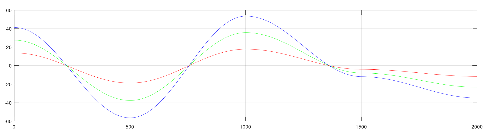
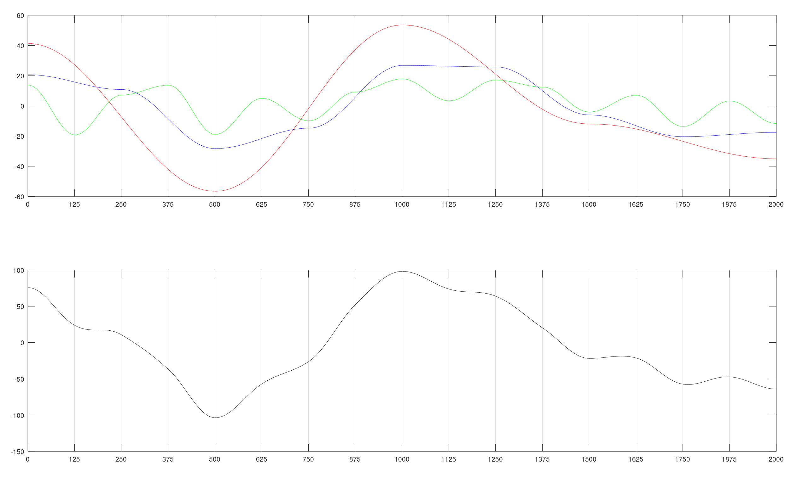

# Perlin Noise basics

## Table of Contents

- [What is Perlin Noise?](#what-is-perlin-noise)
- [How is it generated?](#how-is-it-generated)
    - [1D Perlin Noise](#1d-perlin-noise)
         - [Amplitude and Wavelength](#amplitude-and-wavelength)
    - [Octaves and composition](#octaves-and-composition)
    - [2D Perlin Noise](#1d-perlin-noise)

- [Perlin noise in _Processing_](#perlin_noise_in_processing)

    

## What is Perlin Noise?

**Perlin noise** is a type of gradient noise that uses value interpolation over a series of random values taking into account gradients over vertices. 

Rather than a less than accurate description, the best way to understand Perlin noise is to compare it with pure randomness values: 


In the image above the differences and applications of Perlin Noise can be spotted. **Perlin noise yields series of random values that have spatial continuity, opposite to pure randomness, where each value is completely independent from the previous one**

This spatial continuity, or coherence, has a lot of applications in computer graphics, it can be used to generate images and textures procedurally, surfaces, maps and clouds, among many examples. 

## How is it generated?

In order to be able to check the process in detail, I have also implemented the process in _Matlab_ in a separate folder. We will discern between the 1D case and 2D case. 

### 1D Perlin noise

A basic sequence of perlin noise values can be generated with the following pseudocode:

```csharp
int wavelength  // The separation between points to be interpolated.
int amplitude   // The variability in height of the curve
int numPoints   // The number of points in the sequence. Ideally numPoints >>> wavelength

int[] yValues   // The array that will store the values of the curve

int valueStartWave = random(amplitude)
int valueEndWave = random(amplitude)

for(int currentPoint = 0; currentPoint < numPoints; currentPoint++)
{
    if(currentPoint % wavelength ==0)
    {
        // We have a control point. We set the values for the next wave
        valueStartWave = valueEndWave
        valueEndWave = random(amplitude)
        yValues[currentPoint] = valueStartWave
    }
    else
        // We interpolate the 
        yValues[currentPoint] = interpolate(valueStartWave, valueEndWave, currentPoint)
}
```
####  Amplitude and Wavelength

Let's see how the different parameters behave when generating Perlin noise. The **amplitude** expresses the value variability of the noise. This can be seen in the next figure:



You can see the plot of the same perlin noise distributions, with different _amplitudes_. 
- The <span style="color:blue">blue plot</span> has an amplitude of 120, so it varies from 60 to -60. 
- The <span style="color:green">green plot</span> has an amplitude of 80, so it varies from 40 to -40. 
- The <span style="color:red">red plot</span> has an amplitude of 40, so it varies from 20 to -20. 


The image has been generated with the script `perlinAmplitudeSample` of the Matlab folder. 

Another thing we can spot in the sample above is that the noise function that is produced has the same behavior, it goes downwards and upwards on the same places, and changes slope at the same time. This is because the 3 have been generated with the **same seed** and have the **same wavelength** even if they have different amplitudes. 

The wavelenght of a perlin noise function is the distance between values to interpolate. In the sample above, the wavelength is 500, that means that the noise generates random values (_control values_) on positions 0, 500, 1000, 1500 and 2000, and the rest of the values are interpolations of the control values to the left and right. 

We can compare the effect of having different **wavelenghts** as we just did with the amplitudes:


Now you can see the plot of the same perlin noise distributions, with different _wavelengths_. 

- The <span style="color:red">red plot</span> has a wavelength of 500, so the control points are `0, 500, 1000, 1500, etc.`
- The <span style="color:blue">blue plot</span> has a wavelength of 250, so the control points are `0, 250, 500, 750, etc.`
- The <span style="color:green">green plot</span> has a wavelength of 125, so the control points are `0, 125, 250, 375, etc.`

The wavelenght tells the function which is the distance between random points. The shorter the wavelength, the more variability our noise function will have. 

In the image above though, you can tell that all the plots have the same values at the control points of the red plot (`0, 500, 1000, 1500, etc.`).  There are also crossings between the blue and green plots on the control points of the blue plot (`0, 250, 500, 750, etc.`). That is because the different wavelengths of the plots are multiple between them, so we ensure that the control points coincide. 

The wavelength is usually seen **as the level of detail, or granularity** of the noise. However, having a wavelength that is minimal (2 or 3) leads us to similar results as random noise. How can we build noise function that keep the smoothness of the plot we have seen with larger wavelength and show little fluctuations in detail?

### Octaves and composition

Controlling the wavelength and amplitude will allow us to build noise that is consistent on different scale levels. An image will help much more than an explanation:




### 2D Perlin noise

## Perlin noise in Processing

