**All this material is a backup from : [LODE](https://lodev.org/)** 
Find the original source [**here**](https://lodev.org/cgtutor/plasma.html#Plasmas_with_Palette_Looping_). This tutorial is brilliant and I copied as is because the web page looks a little old and may not last forever. **But all the credit goes to LODE**

# Plasma  

## Table of Contents

- [Introduction](#introduction)
- [Some Functions](#some-functions)
- [Plasmas with Palette Looping](#plasmas-with-palette-looping)
- [RGB Plasmas](#rgb-plasmas)  
    

## Introduction  

The plasma effect is an effect often used in demos to create a wobbly animating effect. There are many ways to generate animating plasmas, and here only one way is discussed: making them as the sum of sine functions and some other functions. By experimenting with parameters and trying different functions, and experimenting with the colors, you'll after a while find a neat looking one.  
  
One of the effects of the demo Second Reality by Future Cube was a plasma, rendered on the sides of a spinning cube:  
  
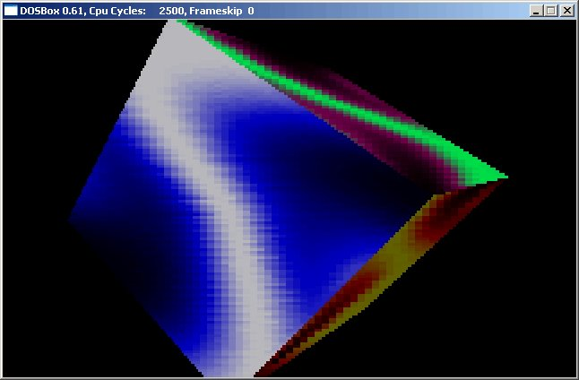  
  
The screenshot also shows how you can run oldskool DOS demos that don't want to run in Windows anymore in the emulator DOSBox :)  

## Some Functions  

Before making the actual plasma, let's study a few functions that can be used to generate plasmas.  
  
The sine function generates values that are always between -1 and +1, and when plotted looks like this:  
  
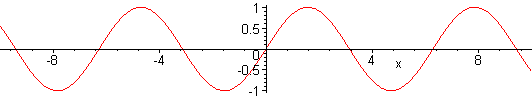  
  
To be useful we plot it in another way however, namely by setting the color value of the pixel to the sine of its x-coordinate:  
  
  
  
The white parts are the peaks of the sine plot, and the black parts the valleys.  
  
This is easily done with the following code:  

```c++
int main(int argc, char *argv[])
{
  screen(256, 256, 0, "Plasma");

  for(int y = 0; y &lt; h; y++)
  for(int x = 0; x &lt; w; x++)
  {
    int color = int(128.0 + (128.0 * sin(x / 8.0)));
    pset(x, y, ColorRGB(color, color, color));
  }
  redraw();
  sleep();
  return(0);
}
```
  
It goes through every pixel, calculates the color of the pixel with the sine function, and plots it. Pixel color values must be between 0 and 256 here, and since a sine function always gives a result between -1 and 1, we transform this to a result between 0 and 256, by multiplying it with 128 and then adding 128 to it. X is divided through 8 to make the sine larger. If you divide it through a smaller value, e.g. 2, you get a sine with a different size:  
  
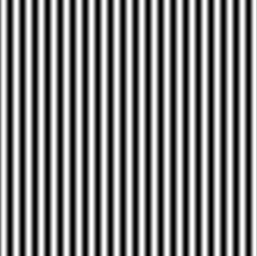  
  
If you use "sin((x + y) / 8.0)" instead, you get a sloped sine:  
  
  
  
Another very nice function for plasmas is the sine of the distance of the pixel to a certain point.  
  
The distance of a pixel to the point (0, 0) is: `sqrt(x \* x + y \* y)`. And the distance of the pixel to the center of the screen is: `sqrt((x - w / 2) \* (x - w / 2) + (y - h / 2) \* (y - h / 2))`. Take the sine of that, and you get the following:  
  
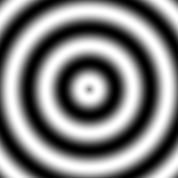  
  
Here's the code that generated this picture:  

```c++
int main(int argc, char *argv[])
{
  screen(256, 256, 0, "Plasma");

  for(int y = 0; y &lt; h; y++)
  for(int x = 0; x &lt; w; x++)
  {
    int color = int(128.0 + (128.0 * sin(sqrt((x - w / 2.0) * (x - w / 2.0) + (y - h / 2.0) * (y - h / 2.0)) / 8.0)));
    pset(x, y, ColorRGB(color, color, color));
  }
  redraw();
  sleep();
  return(0);
}
```

  
By adding many of these functions together (all with different sizes, center points, etc...), and using a better color palette than the boring greyscale used here, you can generate plasmas. To warm up, here's already a real plasma, which is the sum of 2 sine functions:  
  
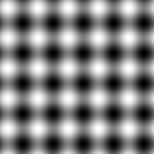  
  
Even though it doesn't look too pretty yet, it's a plasma. It's the sum of a sine in the x-direction and a sine in the y-direction. The code is not much harder than the code from the previous examples, but for clarity the sum of both sines has been split up in several lines. Also, at the end the result is divided through 2, so that we get a value in the range 0-255 again:  

```c++
int main(int argc, char *argv[])
{
  screen(256, 256, 0,"Plasma");

  for(int y = 0; y &lt; h; y++)
  for(int x = 0; x &lt; w; x++)
  {
    int color = int
    (
        128.0 + (128.0 * sin(x / 8.0))
      + 128.0 + (128.0 * sin(y / 8.0))
    ) / 2;
    pset(x, y, ColorRGB(color, color, color));
  }
  redraw();
  sleep();
  return(0);
}
```

## Plasmas with Palette Looping  

The way to get both nice colors, and animation, is to use a color palette (the calculated parameter "color" is then the index to select a color from the palette), and with each frame, shift the palette by a few values, so all the colors of the plasma that was drawn are rotated around. In palettized color mode, video cards have this function to rotate the palette automaticly, so they had to draw the plasma only once and then the palette was changed every frame. However we're working in RGB mode here so we'll have to emulate it.  
  
Because the colors rotate around, the palette shouldn't have any discontinuities, also not when going from the last color back to the first.  
  
This palette is full of discontinuities, so it can't be used for a plasma:  
  
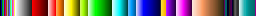  
  
This palette has one discontinuity: from the right to the left (it jumps from yellow back to blue), so can't be used either:  
  
  
  
The following one however can be used, and it's made with the HSVtoRGB function by looping through the Hue (and color hue is known to be circular, see the tutorial about Light and Color).  
  
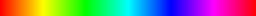  
  
To make a plasma effect this way: generate a palette, generate the plasma buffer that contains the result of the sine function calculations for every pixel, and after these are generated, use them to draw each pixel with the correct color from the palette, and shift the palette every frame.  
  
Here's the part of the code that generates the palette and the plasma.  
  
The plasma array contains the plasma buffer values, the palette array is the color palette, and the buffer array is used to draw the pixels on the screen.  
  
The plasma that's generated is the same one as the black and white one given earlier, but with the animation it looks a bit interesting already.  

```c
#define screenWidth 256
#define screenHeight 256

// Y-coordinate first because we use horizontal scanlines
Uint32 plasma[screenHeight][screenWidth];
Uint32 buffer[screenHeight][screenWidth];
Uint32 palette[256];

int main(int argc, char *argv[])
{
  screen(screenWidth, screenHeight, 0,"Plasma");

  //generate the palette
  ColorRGB colorRGB;
  for(int x = 0; x &lt; 256; x++)
  {
    //use HSVtoRGB to vary the Hue of the color through the palette
    colorRGB = HSVtoRGB(ColorHSV(x, 255, 255));
    palette[x] = RGBtoINT(colorRGB);
  }

  //generate the plasma once
  for(int y = 0; y &lt; h; y++)
   for(int x = 0; x &lt; w; x++)
   {
     int color = int
    (
        128.0 + (128.0 * sin(x / 16.0))
      + 128.0 + (128.0 * sin(y / 16.0))
    ) / 2;
    plasma[y][x] = color;
  }
```
Once everything is generated, the main loop starts. There isn't much math involved anymore.  

```c++
  int paletteShift;

  //start the animation loop, it rotates the palette
  while(!done())
  {
     //the parameter to shift the palette varies with time
     paletteShift = int(getTime() / 10.0);

    //draw every pixel again, with the shifted palette color
    for(int y = 0; y &lt; h; y++)
        for(int x = 0; x &lt; w; x++)
        {
        buffer[y][x] = palette[(plasma[y][x] + paletteShift) % 256];
        }

    //make everything visible
    drawBuffer(buffer[0]);
    redraw();
  }

  return(0);
}
```

  
The result looks like this, but the colors change every frame:  
  
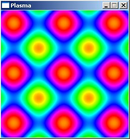  
  
The following image shows how a single color value from the palette moves through the plasma with time (the image shows only 9 steps). This was generated with the same code as above, but with a palette that is white everywhere except at 3 neighboring colors (3 instead of 1 so that you can see it better):  
  
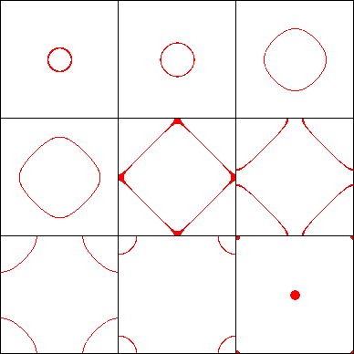  
  
This was still a simple plasma, it's time to try some more complex ones, which are the sum of more functions, including the one with the distance.  
  
In the code, change the part that generates the plasma with this: it's a sum of 4 sines this time, one of them using the distance formula to the top left corner:  

```c++
int color = int
    (
        128.0 + (128.0 * sin(x / 16.0))
      + 128.0 + (128.0 * sin(y / 8.0))
      + 128.0 + (128.0 * sin((x + y) / 16.0))
      + 128.0 + (128.0 * sin(sqrt(double(x * x + y * y)) / 8.0))
    ) / 4;
    plasma[y][x] = color;
```
  
Here are two frames of the result:  
  
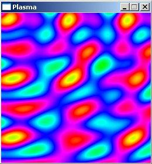 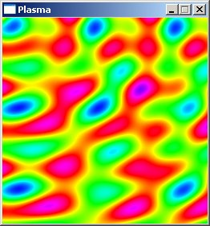  
  
And here's yet another function you can try:  

```c++
int color = int
    (
        128.0 + (128.0 * sin(x / 16.0))
      + 128.0 + (128.0 * sin(y / 32.0))
      + 128.0 + (128.0 * sin(sqrt(double((x - w / 2.0)* (x - w / 2.0) + (y - h / 2.0) * (y - h / 2.0))) / 8.0))
      + 128.0 + (128.0 * sin(sqrt(double(x * x + y * y)) / 8.0))
    ) / 4;
    plasma[y][x] = color; 
```

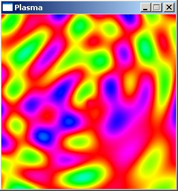  
  
So as you can see, you can keep trying to change parameters until it looks nice.  
  
To conclude this section, let's try a different palette instead, because the one used so far might be a bit too... "busy".  
  
Change the code that generates the palette into:  

```c++
//generate the palette
 ColorRGB colorRGB;
  for(int x = 0; x &lt; 256; x++)
  {
    colorRGB.r = int(128.0 + 128 * sin(3.1415 * x / 32.0));
    colorRGB.g = int(128.0 + 128 * sin(3.1415 * x / 64.0));
    colorRGB.b = int(128.0 + 128 * sin(3.1415 * x / 128.0));
    palette[x] = RGBtoINT(colorRGB);
  } 
```

This gives the following palette:  
  
  
  
The palette is tileable (both on the left and right it's bluegreyish), to make sure the palette is tileable, you have to use pi multiplied by x, and divided through a power of two (if the number of colors itself is a power of two, that is), inside a sine.  
  
This is the same plasma as above, but with this new color palette:  
  
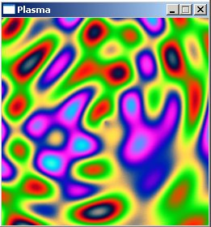  
  
The following palette gives a pretty nifty effect (could be personal preference though ;)):  

```c++
//generate the palette
  ColorRGB colorRGB;
  for(int x = 0; x &lt; 256; x++)
  {
    colorRGB.r = int(128.0 + 128 * sin(3.1415 * x / 16.0));
    colorRGB.g = int(128.0 + 128 * sin(3.1415 * x / 128.0));
    colorRGB.b = 0;
    palette[x] = RGBtoINT(colorRGB);
  }  
```

  
Palette:  
  
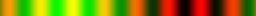  
  
Plasma:  
  
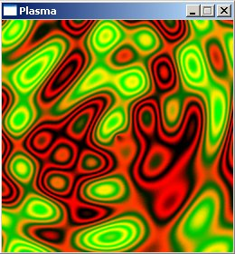  
  

## RGB Plasmas  

Instead of using a palette and looping through it, you can also instead recalculate the sine functions every frame, and actually change the sines every frame by bringing the time into these functions. You can generate R, G and B separately. Now it'll be calculating a lot of sines for every pixel every frame, so it's not going to be fast. It's worth mentioning though, because now the actual shape of the plasma will change with the time.  
  
The "distance" formula is defined with a macro here, dist(a, b, c, d) will calculate the distance between point (a, b) and point (c, d).  
  
Every frame, for every pixel, it calculates a value that is the sum of 4 sines of 4 different distances. Then out of this value, a color value is calculated, and this color value is used to create the R, G and B parameters of the pixel plot command. Due to the way the color is calculated (as an the integer value of a small value, multiplied with 32 afterwards), the color will exist out of different discrete values, so that the effect looks a bit like different cells.  

  

```c++

#define dist(a, b, c, d) sqrt(double((a - c) * (a - c) + (b - d) * (b - d)))

int main(int argc, char *argv[])
{
  screen(256, 256, 0, <span style="color:red">"Plasma"</span>);
  double time;
  while(!done())
  {
    time = getTime() / 50.0;
    for(int y = 0; y &lt; h; y++)
    for(int x = 0; x &lt; w; x++)
    {
      double value = sin(dist(x + time, y, 128.0, 128.0) / 8.0)
             + sin(dist(x, y, 64.0, 64.0) / 8.0)
             + sin(dist(x, y + time / 7, 192.0, 64) / 7.0)
             + sin(dist(x, y, 192.0, 100.0) / 8.0);
      int color = int((4 + value)) * 32;
      pset(x, y, ColorRGB(color, color * 2, 255 - color));
    }
    redraw();
  }
  return(0);
}
```
 
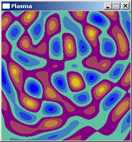  
  
You could also calculate a separate plasma for each color channel, etc..., the possibilities are endless, but this will always be slower than the color palette looping, especially with the unoptimized code from these tutorials.